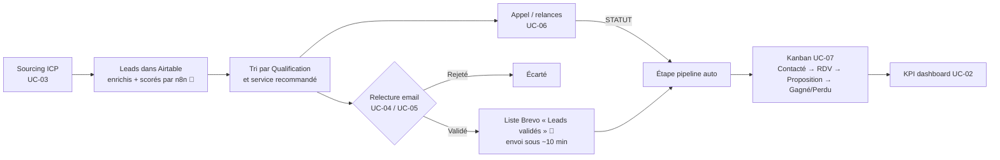

# 01 — Conception produit : GAC Pilot (CRM GrowthLab Agency)

| | |
|---|---|
| **Version** | 1.0 — document de cadrage rétro-documenté à partir du dépôt |
| **Source d'analyse** | Dépôt `growthlab-agency-crm`, commit `7817213` (« Initial commit: CRM GAC Pilot ») |
| **Documents liés** | [PRD](02_product_requirements_document.md) · [Cahier des charges](03_cahier_des_charges.md) · [Architecture](04_architecture_technique_et_systeme.md) |

> **Convention de statut** utilisée dans les quatre documents :
> ✅ **Implémenté** (constaté dans le code) · 🟡 **Partiel / fragile** · 📄 **Documenté seulement** (README, commentaire, texte d'interface, sans code) · 💡 **Recommandation** (proposition de l'auteur, non décidée) · ❓ **À confirmer**.

---

## 1. Méthode et limites de l'analyse

Le dépôt contient **6 fichiers** (≈ 286 Ko) : `README.md`, `build_site.py`, `source-artifact.html` (application, ≈ 2 200 lignes), `site/public/index.html` (build généré), `site/netlify/functions/bridge.js` (fonction serveur) et `site/netlify.toml`. Il n'y a ni `package.json`, ni test, ni pipeline CI/CD, ni schéma de base de données, ni export des workflows n8n.

Conséquence : **tout ce qui se passe en amont et en aval de l'application** (workflows n8n, schéma Airtable, envoi Brevo, scoring IA, collecte des leads) **n'est pas dans le dépôt**. Il n'est décrit ici que dans la mesure où le code ou les textes d'interface en parlent, et il est alors marqué 📄 ou ❓. J'ai vérifié que `site/public/index.html` est strictement identique à la sortie de `build_site.py` appliqué à `source-artifact.html` (build reproductible, chemins `~/gac-pilot` mis à part).

---

## 2. Vision et problème à résoudre

### 2.1 Vision (déduite du dépôt)

GAC Pilot est le **cockpit de prospection commerciale sortante** de l'agence GrowthLab Agency (agence de marketing digital : Google Ads, SEO, création / refonte de site, packs Starter/Growth/Scale/E-commerce — `source-artifact.html:576`). Il offre, au-dessus d'une base Airtable alimentée par une automatisation « Lead Pilot » (n8n), une interface unique pour **trier, valider, relancer et suivre jusqu'au gain** des prospects sourcés automatiquement.

### 2.2 Problème adressé

| Problème (déduit) | Réponse dans le produit | Statut |
|---|---|---|
| Les leads sourcés automatiquement s'accumulent dans Airtable sans vue de pilotage commerciale | Dashboard, tableau Leads, Kanban | ✅ |
| Les emails de prospection générés (objet / corps) doivent être relus avant envoi | Écran « Sourcing & validation » + modale d'édition + aperçu fidèle au rendu final | ✅ |
| Il faut décider quel service proposer à quel prospect | Segmentation par service recommandé (Google Ads, SEO, création de site, refonte) et colonnes d'évaluation (trafic, tracking, signaux Ads…) | ✅ |
| Le suivi d'appels (cold call) et le pipeline sont saisis deux fois | Le champ `STATUT` d'appel met automatiquement à jour `Étape pipeline` | ✅ (`source-artifact.html:1619`) |
| Pas de visibilité sur la performance des emails | Tuiles de statistiques Brevo (30 jours) | ✅ |
| Lancer une nouvelle recherche de prospects sans passer par n8n | Formulaire ICP déclenchant le webhook `search-leads` | 🟡 (déclenchement seul, pas de retour de statut) |
| Réception des demandes de contact du site | Écran « Demandes de contact » | 📄 vide — « pas encore branché » (`source-artifact.html:547`) |

---

## 3. Utilisateurs cibles

Aucun modèle d'utilisateur n'existe dans le code : l'accès est protégé par **un mot de passe unique partagé** (`bridge.js`) et le nom « Kate Guttilla-Stone / Admin » est **codé en dur** dans l'interface (`source-artifact.html:415`, `:559`). Les personas ci-dessous sont donc des **hypothèses** issues des libellés d'interface.

| Persona | Source de l'hypothèse | Besoins principaux |
|---|---|---|
| **P1 — Responsable acquisition / Traffic Manager** (Kate Guttilla-Stone, « Admin ») | Pied de menu, signature des emails (« Traffic Manager ») | Lancer des sourcings, relire/valider les emails, piloter le pipeline et les KPI |
| **P2 — Commercial cold call / closing** | Ligne « — poste cold call/closing — · Commercial » (`:560`), colonnes `STATUT`, `RELANCE 1/2`, `COMMENTAIRE`, mention « Ifaliana » dans le code | Appeler, consigner l'issue de l'appel, relancer, fixer un RDV |
| **P3 — Direction de l'agence** ❓ | Non mentionnée | Lire des KPI (valeur pipeline, deals gagnés) — usage à confirmer |

---

## 4. Proposition de valeur

1. **Un seul écran de travail** pour passer du lead brut à l'email validé puis au deal gagné.
2. **Pilotage « tableur »** familier (tri, filtre par colonne, édition en place, recopie, actions groupées, copie vers Sheets) pour traiter vite de gros volumes.
3. **Aide à la décision commerciale** : indicateurs de maturité digitale de chaque prospect, liens directs vers Google Ads Transparency et Meta Ads Library.
4. **Humain dans la boucle** avant l'envoi d'emails (validation obligatoire avant que le lead rejoigne la liste Brevo — 📄 règle appliquée côté n8n).
5. **Faible coût de possession** : site statique + une fonction serverless, sans base propre (Airtable fait foi).

---

## 5. Cas d'usage et parcours utilisateurs

### 5.1 Cas d'usage

| ID | Cas d'usage | Acteur | Statut |
|---|---|---|---|
| UC-01 | Se connecter avec le mot de passe d'accès | Tous | ✅ |
| UC-02 | Consulter les KPI et la répartition des leads sur une période | P1, P3 | ✅ |
| UC-03 | Lancer un sourcing selon un ICP (secteur, poste, localisation, statut email, nom de fichier) | P1 | 🟡 |
| UC-04 | Relire, corriger, valider ou rejeter l'email d'un lead | P1 | ✅ |
| UC-05 | Valider/rejeter en masse tous les leads du filtre courant | P1 | ✅ |
| UC-06 | Appeler un lead et consigner `STATUT`, relances, commentaire | P2 | ✅ |
| UC-07 | Faire avancer un deal dans le Kanban (glisser-déposer) | P1, P2 | ✅ |
| UC-08 | Qualifier un lead (Chaud/Tiède/Froid), chiffrer un deal, choisir un pack | P1, P2 | ✅ (si colonnes présentes dans Airtable, voir §9) |
| UC-09 | Ouvrir la fiche d'évaluation d'un prospect et contrôler ses pubs concurrentes | P1, P2 | ✅ |
| UC-10 | Suivre la performance des emails (Brevo) | P1, P3 | ✅ |
| UC-11 | Traiter les demandes de contact entrantes du site | P1 | 📄 non branché |
| UC-12 | Gérer les utilisateurs et leurs rôles | Admin | 📄 liste statique non fonctionnelle |

### 5.2 Parcours principal — de la source au gain

### 5.3 Parcours « validation d'emails » (P1)
1. Menu **Sourcing & validation** (badge = leads « Pas Validé » ou vides) → sous-menu par service.
2. Les leads sont triés par qualification (Chaud d'abord) ; le filtre par défaut masque les leads déjà validés.
3. Clic sur **Voir / éditer** → modification de l'objet et du corps, bascule **Aperçu** (rendu identique au nœud n8n « Format Email HTML », avec lien d'agenda et signature ajoutés), choix de *Pas Validé / Validé / Rejeté*, **Enregistrer**.
4. Alternative en masse : barre « Appliquer à toutes les lignes du filtre actuel » (toutes pages), avec confirmation.

### 5.4 Parcours « cold call » (P2)
1. Menu **Leads** → sous-menu *Google Ads* (< 50 salariés) ou *Création de site* (sans site web, colonnes SEO masquées, téléphone et avis Google mis en avant).
2. Appel via lien `tel:`, saisie de `STATUT` (NRP, PI, PB NUMERO, REPONDEUR, A RAP, BARRAGE SECRETAIRE, RDV fixé), `RELANCE 1/2`, `COMMENTAIRE`.
3. Correspondance automatique vers l'étape pipeline (NRP/REPONDEUR/A RAP/BARRAGE SECRETAIRE → *Contacté* ; PI → *Perdu* ; RDV fixé → *RDV programmé*). `PB NUMERO` n'a pas de correspondance ✅ constaté.

---

## 6. Indicateurs de réussite

Indicateurs **déjà calculés** dans le produit (✅) et indicateurs **proposés** (💡). Aucune cible chiffrée n'est définie dans le dépôt : elles sont à fixer (voir §10).

| Indicateur | Définition | Source | Statut |
|---|---|---|---|
| Leads sourcés | Nombre de leads sur la période (`Date détection`) | Dashboard | ✅ |
| Taux de qualification | (Chaud + Tiède) / total | Dashboard | ✅ |
| Emails validés | `Validation mail = Validé` | Dashboard | ✅ |
| Deals gagnés / valeur gagnée | `Étape pipeline = Gagné`, somme `Valeur deal` | Dashboard | ✅ |
| Valeur du pipeline actif | Somme `Valeur deal` hors Gagné/Perdu | Dashboard | ✅ |
| Délivrabilité, ouverture, bounces, spam, désabonnements | API Brevo via n8n | Dashboard | ✅ (chiffres « approximatifs » possibles) |
| Taux de réponse, taux de RDV, taux de conversion lead → gagné | Ratios entre étapes | — | 💡 |
| Délai moyen validation → premier contact | Horodatages de changement d'étape | — | 💡 (nécessite historisation, absente) |
| Temps de traitement d'un lead | Mesure d'usage | — | 💡 |

---

## 7. Périmètre

### 7.1 MVP — existant en production (✅ sauf mention)
- Écran de connexion par mot de passe partagé.
- Dashboard : 6 KPI, entonnoirs (qualification, secteur, pipeline), « À traiter en priorité » (6 leads chauds non validés), leads récents, stats Brevo, filtre de période.
- Tableau **Leads** et tableau **Sourcing & validation** : tri, filtres par colonne, recherche globale, pagination, redimensionnement, retour à la ligne, édition en place, poignée de recopie, actions groupées, copie pour Sheets, segmentation par service.
- Édition d'email avec aperçu ; validation unitaire ou en masse.
- Kanban de 9 étapes (*Nouveau → … → Gagné / Perdu*).
- Fiche d'évaluation prospect + liens Ads Transparency / Meta Ads Library.
- Lancement d'un sourcing (🟡).
- Rafraîchissement automatique (25 s) et notification des nouveaux leads.

### 7.2 Évolutions envisagées (issues du dépôt ou recommandées)
| Évolution | Origine | Priorité proposée |
|---|---|---|
| Brancher le flux « Demandes de contact » (formulaire du site) | 📄 écran vide, texte explicite | Moyenne |
| Gestion réelle des utilisateurs / rôles (Admin vs Commercial) | 📄 liste statique | Haute si > 1 utilisateur |
| Réécriture d'email par IA dans la version hébergée | 📄 bouton désactivé hors Claude (`build_site.py`) | Basse ❓ |
| Retour d'état du sourcing (en cours / terminé / échec) | 💡 | Moyenne |
| Historique des changements d'étape et d'activités | 💡 | Moyenne |
| Création de colonnes Airtable manquantes (voir §9) | 📄 message « À créer dans Airtable » | **Haute** |

### 7.3 Exclusions (non traité aujourd'hui)
- Création manuelle d'un lead ou import CSV dans l'interface.
- Envoi direct d'emails depuis l'application (l'envoi passe par Brevo via n8n).
- Facturation, devis, contrats, gestion de projet client.
- Multi-agences / multi-tenant, application mobile native.
- Gestion de la conformité RGPD (consentement, suppression) dans l'interface ❓ à cadrer, voir [cahier des charges §7](03_cahier_des_charges.md).

---

## 8. Cohérence avec les autres documents
Les exigences détaillées dérivées de ces cas d'usage sont dans le [PRD](02_product_requirements_document.md) (identifiants `EXG-*`, `US-*`). Les contraintes, risques et livrables sont dans le [cahier des charges](03_cahier_des_charges.md). L'implémentation est décrite dans l'[architecture](04_architecture_technique_et_systeme.md).

---

## 9. Constats importants pour le produit

1. **Dépendance à des colonnes Airtable optionnelles.** L'application prévient (écran Paramètres) que `Étape pipeline`, `Valeur deal`, `Pack`, `Statut appel`, `Prochaine action`, `Responsable` doivent exister dans Airtable (`build_site.py`, liste `attendues`). **Incohérence constatée** : l'interface édite `Prochaine action Kate` (pas `Prochaine action`) et n'utilise aucune colonne `Statut appel` (elle utilise `STATUT`). La vérification de l'écran Paramètres ne correspond donc pas aux colonnes réellement éditées.
2. **Libellés contradictoires de synchronisation.** Le code source parle d'une « tâche planifiée toutes les heures tant qu'une session Claude Code reste active sur le Mac » ; la version hébergée écrit directement dans Airtable via n8n. Seule la seconde est vraie en production ; les textes de la version source ne le sont plus (remplacés au build).
3. **Mono-utilisateur de fait** : pas d'identité par utilisateur, donc pas de « Responsable » automatique ni d'audit.

---

## 10. Hypothèses, questions ouvertes et décisions à valider

**Hypothèses**
- H1 : le produit est un outil interne à l'agence, utilisé par 1 à 3 personnes.
- H2 : Airtable (base « Lead Pilot ») est la source de vérité ; l'application n'a pas de base propre.
- H3 : les noms « Kate » et « Ifaliana » désignent des personnes réelles de l'équipe ; leur rôle exact est inféré.
- H4 : les packs et services listés reflètent le catalogue public du site de l'agence au 2026-09-12 (commentaire `:575`).

**Questions ouvertes**
- Q1 : combien d'utilisateurs, avec quels rôles, et chacun doit-il être identifié ?
- Q2 : quels sont les objectifs chiffrés (leads/mois, taux de réponse, RDV, CA) ?
- Q3 : quel est le volume cible de leads (la lecture est plafonnée à ce que n8n renvoie ; la limite de 1 000 de l'interface n'est pas appliquée côté pont) ?
- Q4 : le flux « Demandes de contact » est-il prioritaire ?
- Q5 : la réécriture IA des emails doit-elle exister en production ?
- Q6 : quel cadre RGPD / prospection B2B s'applique (base légale, durée de conservation, désinscription) ?

**Décisions à valider**
- D1 : maintenir Airtable comme base unique ou prévoir une base applicative.
- D2 : maintenir le mot de passe partagé ou passer à une authentification nominative.
- D3 : confirmer la liste des étapes de pipeline et des valeurs de `STATUT`.
- D4 : arbitrer le périmètre du prochain incrément (contacts entrants, utilisateurs, retour du sourcing).
