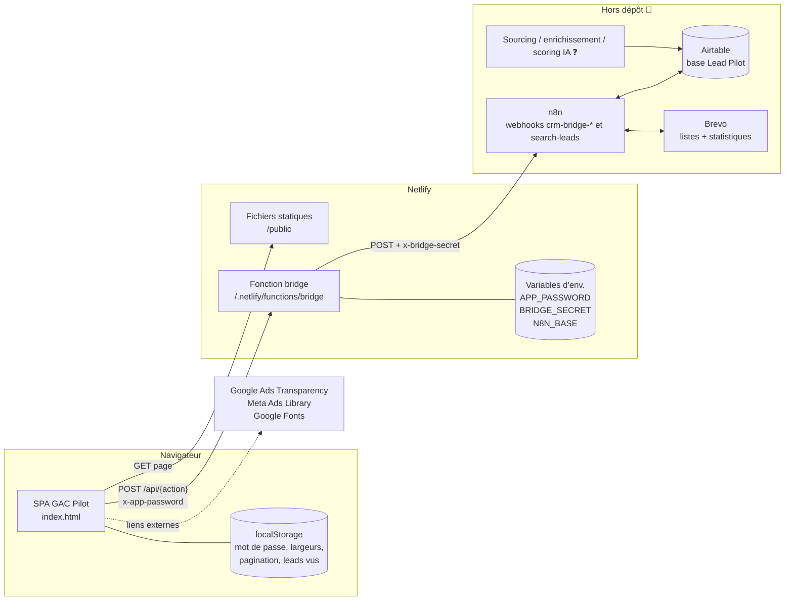
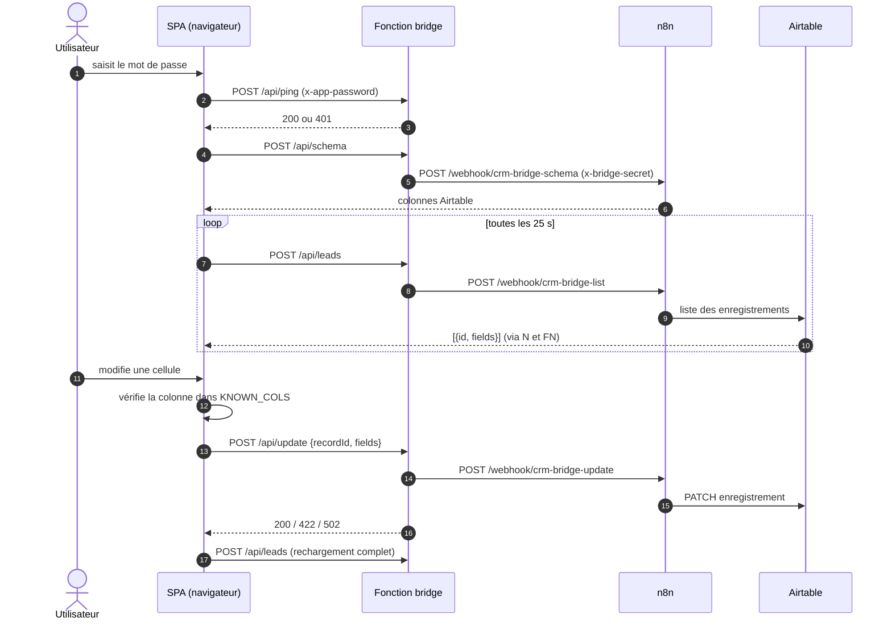
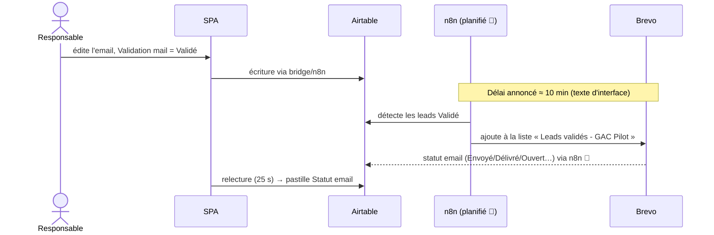
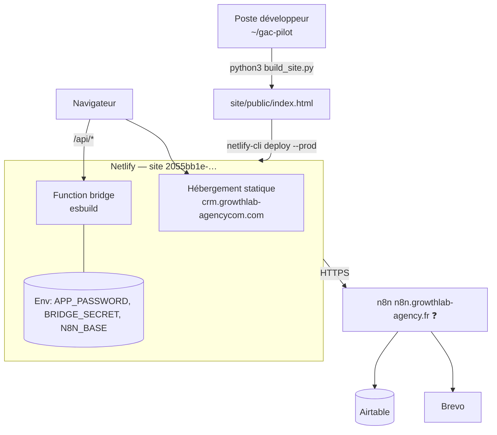
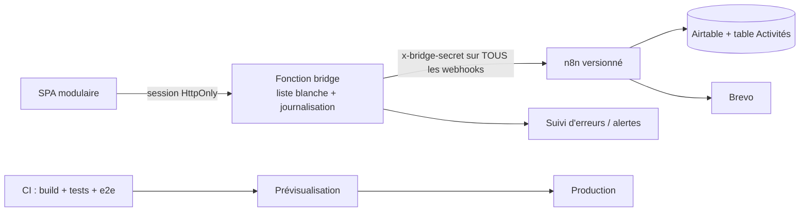

# 04 — Architecture technique & architecture système : GAC Pilot

| | |
|---|---|
| **Version** | 1.0 — architecture constatée au commit `7817213` |
| **Documents liés** | [Conception produit](01_conception_produit.md) · [PRD](02_product_requirements_document.md) · [Cahier des charges](03_cahier_des_charges.md) |
| **Légende** | ✅ présent dans le dépôt · 🟡 partiel · 📄 décrit mais hors dépôt · ❌ absent · 💡 recommandation |

Abréviations : **SA** = `source-artifact.html`, **IDX** = `site/public/index.html`, **BR** = `site/netlify/functions/bridge.js`, **BS** = `build_site.py`, **NT** = `site/netlify.toml`.

---

# PARTIE A — ARCHITECTURE ACTUELLE

## 1. Vue d'ensemble

GAC Pilot est une **application monopage statique** (HTML + CSS + JavaScript sans framework) servie par Netlify, qui dialogue avec **une seule fonction serverless** (`bridge`). Cette fonction authentifie l'utilisateur par mot de passe puis relaie les requêtes vers des **webhooks n8n**, lesquels lisent/écrivent **Airtable** et interrogent **Brevo**. Il n'y a **pas de base de données propre**.

| Couche | Technologie constatée | Fichiers |
|---|---|---|
| Présentation | HTML/CSS/JS vanilla en IIFE `"use strict"`, polices Google Fonts (Plus Jakarta Sans, JetBrains Mono) | SA, IDX |
| Accès aux données (client) | Objet `API` (fetch POST JSON) + `makeDb()` imitant l'API Firestore-like de l'artifact (`collection/doc/onSnapshot/update/add`) | BS (bloc `SHIM`) |
| Backend | Netlify Function Node, bundler esbuild | BR, NT |
| Intégration | n8n (webhooks HTTP) — **hors dépôt** | 📄 |
| Données | Airtable, base « Lead Pilot » — **hors dépôt** | 📄 |
| Emailing | Brevo — **hors dépôt** | 📄 |
| Build / déploiement | Script Python + `netlify-cli` manuel | BS, README |

### 1.1 Diagramme de composants



## 2. Organisation du dépôt

```
.
├── README.md                      structure, déploiement, variables d'environnement
├── build_site.py                  source → site hébergé (8 substitutions)
├── source-artifact.html           SOURCE de l'application (à éditer)
├── .gitignore                     .netlify/, .DS_Store, *.log
└── site/                          projet Netlify
    ├── netlify.toml               publish, functions, redirection /api/*, en-têtes
    ├── netlify/functions/bridge.js
    └── public/index.html          BUILD GÉNÉRÉ (ne pas éditer)
```

- ✅ **Reproductibilité du build** : en exécutant `build_site.py` (chemin de base adapté) sur `SA`, la sortie est octet pour octet `IDX`.
- Structure interne de `SA` (≈ 2 200 lignes) : styles (l. 4-336), modales (337-394), barre latérale (395-416), six vues `view-*` (418-565), script unique (568-2198) organisé en sections commentées : constantes et colonnes, segmentation, filtres/tri/pagination, rendu (dashboard, Kanban, tableaux), édition en grille, actions groupées, poignée de recopie, Brevo, aperçu d'email, modales, navigation, initialisation.
- 🟡 Dualité des cibles : la même source doit fonctionner comme *artifact Claude* (`claude.use('db')`, `claude.use('sample')`) et comme site (substitutions de `BS`).

## 3. Application cliente

### 3.1 État et rendu
- État global minimal : `state = { leads, ready, lastSync }` ; chaque lead = `{ id, fields }` où `fields` reflète les colonnes Airtable.
- Rendu par **reconstruction de `innerHTML`** à chaque changement (`renderAll`) ; échappement via `esc()` (trous connus : [03 §9 E2](03_cahier_des_charges.md)).
- **Pas de gestion d'état réactive ni de routeur** : la navigation bascule l'attribut `hidden` des sections `view-*` (`activateView`) ; pas d'URL par vue.
- Persistance locale (`localStorage`) : `gac_pwd`, `gacPilotColWidths(+V)`, `gacPilotPageSize`, `gacPilotWrap_<table>`, `gacPilotSeenLeadIds`. Les filtres de colonnes sont volontairement non persistés (SA:707-711).

### 3.2 Écrans
| Vue | Rôle | Sources de données |
|---|---|---|
| Dashboard | KPI, entonnoirs, tâches, leads récents, stats Brevo | `state.leads`, `/api/brevo` |
| Pipeline | Kanban 9 colonnes | `state.leads` filtrés sur `Étape pipeline` |
| Leads | Tableau éditable (3 segments) | `state.leads` |
| Sourcing & validation | Formulaire ICP + tableau éditable (4 segments) + modale email | `state.leads`, `/api/sourcing` |
| Demandes de contact | Écran vide | — |
| Paramètres | État de connexion, utilisateurs (statique) | `state.lastSync`, `KNOWN_COLS` |

### 3.3 Modèle de données manipulé (vue client)
Il n'existe pas de schéma dans le dépôt ; le tableau suit `LEAD_COLUMNS` (SA:581-637). Regroupement fonctionnel des 55 colonnes :

| Groupe | Champs (extraits) | Éditable |
|---|---|---|
| Identité | Prénom, Nom, Poste, Entreprise, Email, Téléphone, Site web, Linkedin, Linkedin Entreprise | Oui |
| Firmographie | Secteur, Taille, Année de création, Ville, Etat, Pays, Adresse complète Entreprise | Oui |
| Suivi d'appel | STATUT, RELANCE 1, RELANCE 2 (liste : NRP, PI, PB NUMERO, REPONDEUR, A RAP, BARRAGE SECRETAIRE, RDV fixé), COMMENTAIRE | Oui |
| Qualification & scoring | Qualification (Chaud/Tiède/Froid), Raison (scoring IA), Service recommandé | Oui |
| Enrichissement web | Trafic organique, Autorité domaine, Mots-clés organiques, Backlinks, CMS, E-commerce, Tracking GTM/GA4, Pixel Meta, Signal Google Ads, SSL | Lecture seule |
| Google Maps | Note Google, Nombre avis Google, Catégorie Maps, Fiche Google My Business, Coordonnées GPS | Mixte |
| Email | Email objet, Email corps, Validation mail (multi), Email envoyé le, Statut email (multi) | Mixte |
| Pipeline commercial | Étape pipeline, Valeur deal, Pack, Prochaine action Kate, Responsable | Oui |
| Méta | Persona, Source, Description entreprise, Date détection | Mixte |
| Calculés | Liens Google Ads Transparency, Meta Ads Library | n/a |

Les champs de liste Airtable peuvent arriver sous forme de tableau : la fonction `scalar()` prend le premier élément. Le type exact de chaque colonne côté Airtable est ❓ non vérifiable.

### 3.4 Fonctionnement du « faux client de base de données » (`makeDb`)
| Appel côté UI | Traduction | Requête réseau |
|---|---|---|
| `collection('leads').onSnapshot(cb)` | `pull()` immédiat puis toutes les **25 s** | `POST /api/leads` |
| `doc('leads/<id>').update({fields})` | mise à jour puis `pull()` complet | `POST /api/update` `{recordId, fields}` |
| `collection('sourcingRequests').add({icp,…})` | envoi de l'objet complet | `POST /api/sourcing` |
| `doc('meta/lastSync').onSnapshot` | synthétisé localement (`at: Date.now()`) | aucune |
| Stats Brevo | direct | `POST /api/brevo` `{days:30}` toutes les 60 s |
| Au démarrage | vérification des colonnes | `POST /api/schema` |

Particularités : `limit()` est ignoré ; `meta/lastSync` indique l'heure de la **lecture** et non celle d'une synchronisation ; l'`add()` sur `sourcingRequests` ne crée aucun enregistrement local (il déclenche seulement le webhook).

## 4. API (fonction `bridge`)

Redirection `NT` : `/api/*` → `/.netlify/functions/bridge/:splat` (status 200, forcée). Toutes les routes sont en **POST** (sinon 405).

| Action (`/api/…`) | Entrée | Appel n8n | Sortie | Erreurs |
|---|---|---|---|---|
| `ping` | — | aucun | `{ok:true}` | 401 |
| `leads` | — | `POST /webhook/crm-bridge-list` | tableau `[{id, fields}]` | 502 `bridge_error` |
| `schema` | — | `POST /webhook/crm-bridge-schema` | `{colonnes:[…]}` | 502 |
| `brevo` | `{days}` (défaut 30) | `POST /webhook/crm-bridge-brevo` | objet statistiques (`ok, envois, tauxDelivrabilite, delivres, tauxOuverture, ouvertures, bounces, spam, desabonnes, periode, approximatif`) | 502 |
| `update` | `{recordId, fields}` | `POST /webhook/crm-bridge-update` | `{ok:true}` | 400 `missing_record` ; 422 `colonne_absente` (motif `UNKNOWN_FIELD_NAME`) ; 422 `airtable_error` ; 502 |
| `sourcing` | `{icp}` ou objet ICP | `POST /webhook/search-leads` (**sans** `x-bridge-secret`) | `{ok:true}` | 502 `sourcing_error` |
| autre | — | — | — | 404 `action_inconnue` |

Erreurs communes : 500 `config_manquante` (variables absentes) ; 401 `unauthorized` ; 502 `reseau` (exception réseau). Les réponses sont `application/json` avec `cache-control: no-store`.

Remarques : l'action est déduite du **dernier segment** du chemin ; aucun contrôle de schéma/longueur sur `fields` (l'utilisateur authentifié peut écrire n'importe quel champ Airtable existant, y compris ceux affichés « lecture seule » — le caractère readonly n'est appliqué que dans l'interface) ; `fetch` n8n sans délai d'expiration explicite.

## 5. Intégrations et flux

### 5.1 Flux de lecture et d'écriture


### 5.2 Flux « validation d'email → envoi » (partie amont 📄)

Le mécanisme exact (déclencheur, fréquence, écriture retour des statuts, `Email envoyé le`) n'est **pas** dans le dépôt.

### 5.3 Flux de sourcing
Formulaire ICP → `POST /api/sourcing` → webhook `search-leads` → (📄) collecte, enrichissement, scoring IA → nouvelles lignes Airtable → apparaissent à la lecture suivante, avec toast « nouveaux leads » (`gacPilotSeenLeadIds`). Aucun retour d'état n'est prévu.

### 5.4 Aperçu d'email
La fonction `construireApercuHtml` **recopie** le nœud n8n « Format Email HTML » (SA:1950-1977). L'agenda Calendly, l'expéditeur et la signature sont codés en dur (SA:1954, 1984). Risque de dérive documenté en [03 R9](03_cahier_des_charges.md).

## 6. Authentification, autorisations, sécurité

| Sujet | Constat |
|---|---|
| Authentification | Mot de passe unique `APP_PASSWORD` envoyé dans l'en-tête `x-app-password` à chaque requête ; comparaison `!==` ; pas de session, jeton, expiration ni limitation de débit |
| Mémorisation | Mot de passe stocké en clair dans `localStorage.gac_pwd` (exposé à tout script de la page : lien direct avec les trous XSS) |
| Autorisations | Aucune : tout utilisateur authentifié a tous les droits (voir [02 §1](02_product_requirements_document.md)) |
| Secret serveur → n8n | `BRIDGE_SECRET` en variable d'environnement, jamais envoyé au navigateur ✅ ; **non envoyé** à `search-leads` |
| Transport | HTTPS fourni par Netlify ; pas de HSTS explicite dans `NT` |
| En-têtes | `X-Frame-Options: SAMEORIGIN`, `X-Content-Type-Options: nosniff`, `Referrer-Policy: strict-origin-when-cross-origin` ; pas de CSP |
| XSS | `esc()` majoritaire ; trois rendus non échappés (voir [03 E2](03_cahier_des_charges.md)) |
| CSRF | Peu exposé (en-tête personnalisé requis, pas de cookie) |
| Données personnelles | Nom, email, téléphone, LinkedIn de prospects ; aucune mention de base légale/durée (RGPD ❓) |
| Dépôt | Aucun secret ; URL n8n et identifiant de site Netlify présents (non sensibles en soi) |

## 7. Gestion des erreurs

| Niveau | Comportement |
|---|---|
| Fonction | Erreurs normalisées `{code, message}` (§4) ; exceptions réseau → 502 `reseau` |
| Client – lecture | Bandeau d'état (`setStatus`, couleur d'avertissement) ; 401 → écran de connexion |
| Client – écriture | Toast « Échec de l'enregistrement : … » ; garde `KNOWN_COLS` bloquant les colonnes absentes ; Kanban : re-rendu en cas d'échec ; actions groupées : décompte réussites/échecs |
| Client – Brevo | Message dans le panneau, sans impact sur le reste |
| Lacunes | Pas de relance automatique, pas de file hors ligne, pas de détection de conflit d'édition (dernier écrit gagne) ; une écriture 401 n'affiche pas l'écran de connexion |

## 8. Tests, qualité, CI/CD, environnements

| Sujet | État |
|---|---|
| Tests unitaires / intégration / E2E | ❌ aucun |
| Lint / format / typage | ❌ aucun |
| Garde du build | 🟡 `sub_once` échoue si une ancre est absente ou en double (contrôle partiel, exécuté à la main) |
| CI | ❌ aucun workflow (pas de `.github/`) |
| Déploiement | Manuel : `python3 build_site.py` puis `npx netlify-cli@latest deploy --prod --dir public --functions netlify/functions --site <id>` (README) |
| Environnements | Un seul : production `crm.growthlab-agencycom.com` ; pas de préproduction identifiée |
| Configuration | 3 variables Netlify : `BRIDGE_SECRET`, `APP_PASSWORD` (obligatoires), `N8N_BASE` (optionnelle, défaut `https://n8n.growthlab-agency.fr`) |
| Reproductibilité | `netlify-cli@latest` non épinglé ; build Python avec chemin `~/gac-pilot` en dur |

## 9. Observabilité, sauvegarde, reprise

| Sujet | État |
|---|---|
| Journalisation applicative | ❌ aucune (`console.*` absent de `BR`) ; journaux de fonctions Netlify par défaut ❓ |
| Métriques / alertes / suivi d'erreurs navigateur | ❌ |
| Santé | Action `ping` (contrôle du mot de passe seulement ; ne teste pas n8n) |
| Sauvegardes | 📄 ❓ aucune au niveau du dépôt (les données sont dans Airtable) |
| Retour arrière | ❓ non documenté (Netlify conserve les déploiements précédents ❓ à confirmer) |
| Reprise après incident | ❌ non documentée |

## 10. Déploiement



---

# PARTIE B — AMÉLIORATIONS RECOMMANDÉES 💡

Ces propositions **ne sont pas décidées** ; elles découlent des écarts du §6–§9 et des risques du [cahier des charges §11](03_cahier_des_charges.md). Priorité : **P0** à traiter avant toute extension, **P1** court terme, **P2** moyen terme.

## 11. Tableau des recommandations

| ID | Recommandation | Justification | Prio | Effort relatif* | Lien |
|---|---|---|---|---|---|
| AR-01 | Échapper toutes les valeurs injectées en HTML (`renderTasks`, `funnelBar`, pastilles) ou utiliser `textContent` | Données issues de scraping/enrichissement ; combiné à `gac_pwd` en clair, un XSS expose le mot de passe | P0 | Faible | NF-004, E2 |
| AR-02 | Authentifier `search-leads` avec `x-bridge-secret` côté fonction et le vérifier dans n8n | Webhook potentiellement ouvert, déclenche des coûts de sourcing | P0 ❓ | Faible | E4 |
| AR-03 | Ne plus stocker le mot de passe en clair : jeton de session signé court (cookie `HttpOnly; Secure; SameSite`) émis par la fonction | Réduit l'impact d'une fuite | P1 | Moyen | SEC-3 |
| AR-04 | Comparaison en temps constant + limitation des tentatives + délai croissant | Anti force brute | P1 | Faible | SEC-4/5 |
| AR-05 | Authentification nominative (ex. fournisseur d'identité, ou Netlify Identity ❓) et rôles Admin/Commercial ; `Responsable` renseigné automatiquement | Traçabilité, EXG-F-081/082 | P1 | Moyen–élevé | ARB-1 |
| AR-06 | Liste blanche de champs modifiables dans `bridge.js` (et validation de type) | Aujourd'hui tout champ Airtable peut être écrit par un utilisateur authentifié, y compris les champs « lecture seule » | P1 | Faible | §4 |
| AR-07 | En-têtes : CSP stricte, HSTS, `Permissions-Policy` ; héberger les polices localement | Défense en profondeur ; RGPD (Google Fonts) | P1 | Faible | SEC-6, NF-016 |
| AR-08 | Tests : fonctions pures extraites (segmentation, mapping STATUT, agrégations, aperçu), tests du pont avec n8n simulé, 1 test E2E (Playwright) | Zéro test aujourd'hui | P1 | Moyen | C1 |
| AR-09 | CI (build, tests, vérification que `public/index.html` = sortie du build) + déploiement automatique sur prévisualisation puis production ; épingler `netlify-cli` | Fiabilité, reproductibilité | P1 | Moyen | C2, C3 |
| AR-10 | Rendre `build_site.py` indépendant du chemin local ; envisager de remplacer les substitutions textuelles par une vraie abstraction `DataAdapter` injectée (deux implémentations : artifact / HTTP) | Fragilité des 8 ancres, dualité de cibles | P1 | Moyen | R4, ARB-4 |
| AR-11 | Lecture incrémentale : paramètre `modifiedSince`, ou pagination côté n8n ; ne pas relancer `pull()` complet après chaque écriture (mise à jour locale optimiste) | Charge Airtable et latence croissantes avec le volume | P1 | Moyen | PERF-2, R7 |
| AR-12 | Gestion de conflit d'édition (comparer la valeur d'origine avant écriture) | « Dernier écrit gagne » | P2 | Moyen | §7 |
| AR-13 | Expiration/401 sur écriture → écran de connexion ; délai d'expiration (`AbortController`) et nouvelle tentative contrôlée vers n8n | Robustesse | P1 | Faible | A3 |
| AR-14 | Journalisation structurée dans `bridge.js` (action, statut, durée, sans données personnelles) + alerte d'erreurs (service de suivi d'erreurs ou notification n8n) ; endpoint de santé testant n8n | Observabilité nulle | P2 | Faible–moyen | C4, EXP-3 |
| AR-15 | Exporter et versionner les workflows n8n ; documenter le schéma Airtable ; procédure de sauvegarde Airtable | Dépendances critiques hors dépôt | P1 | Faible | Lot B, EXP-2 |
| AR-16 | Champ explicite « Segment » (ou règles configurables) au lieu de la recherche de mots dans `Service recommandé` | Fragilité de RG-09 | P2 | Faible | R8 |
| AR-17 | Source unique du gabarit email (n8n expose le rendu, ou paquet partagé) ; paramétrer expéditeur/agenda | Évite la dérive aperçu/envoi | P2 | Moyen | R9 |
| AR-18 | Accessibilité : `lang`, rôles et labels ARIA, navigation clavier du Kanban (alternative au glisser-déposer), focus visibles, audit de contrastes | RGAA/WCAG | P1 | Moyen | NF-009 |
| AR-19 | Historique des activités (table Airtable « Activités » alimentée par n8n) | EXG-F-090, KPI de délais | P2 | Moyen | PRD |
| AR-20 | Découpage progressif du monolithe en modules (données, rendu, grille, pipeline, email) avec bundler léger | Maintenabilité | P2 | Élevé | §2 |

\* *Effort relatif* : indication qualitative de l'auteur pour hiérarchiser ; **aucune estimation en jours ou en coût** n'est fournie.

## 12. Architecture cible possible (schéma indicatif 💡)


Cette cible conserve Airtable comme source de vérité (hypothèse H2 de [01](01_conception_produit.md)) ; une base applicative n'est justifiée que si la décision ARB-2 le demande.

## 13. Ordre de mise en œuvre suggéré
1. **Sécurité immédiate** : AR-01, AR-02, AR-06 (faible effort, fort gain).
2. **Fiabilité** : AR-13, AR-08, AR-09, AR-10, AR-15.
3. **Accès** : AR-03/04, puis AR-05 si l'équipe grandit.
4. **Passage à l'échelle et confort** : AR-11, AR-12, AR-14, AR-18.
5. **Évolutions** : AR-16, AR-17, AR-19, AR-20 selon arbitrages ([03 §11.2](03_cahier_des_charges.md)).

---

## 14. Hypothèses, questions ouvertes et décisions à valider

**Hypothèses**
- H1 : les webhooks n8n renvoient les formes de données attendues par `bridge.js` (tableau d'objets `{id, fields}`, objet `{colonnes}`, objet de stats) — déduites du code du pont.
- H2 : le délai « ~10 minutes » entre validation et envoi Brevo est une tâche planifiée n8n (texte d'interface seulement).
- H3 : Netlify fournit HTTPS et l'historique de déploiements (non vérifié).
- H4 : le domaine `n8n.growthlab-agency.fr` est l'instance de production (valeur par défaut du code).

**Questions ouvertes**
- Q1 : n8n et Airtable sont-ils sauvegardés / versionnés ? Qui y a accès ?
- Q2 : `search-leads` est-il protégé côté n8n ? Quelles autres entrées publiques existent ?
- Q3 : types exacts des colonnes Airtable (listes simples/multiples, booléens, dates) ?
- Q4 : volume actuel de leads et limites de l'offre Airtable/Netlify utilisées ?
- Q5 : où atterrissent les journaux de la fonction et combien de temps sont-ils conservés ?
- Q6 : quel outil de sourcing/scoring alimente les colonnes d'enrichissement (nom, coût, conditions d'usage des données) ?

**Décisions à valider**
- D1 : validation du plan AR-01..AR-20 et de leur ordre (§13).
- D2 : adoption d'une authentification nominative (AR-05) et choix du fournisseur.
- D3 : conserver ou non la dualité artifact Claude / site hébergé (AR-10, AR-20).
- D4 : mise en place d'un environnement de préproduction (AR-09).
- D5 : politique de conservation et de sauvegarde des données prospects (AR-15, RGPD).
