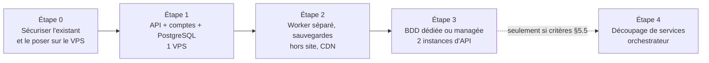
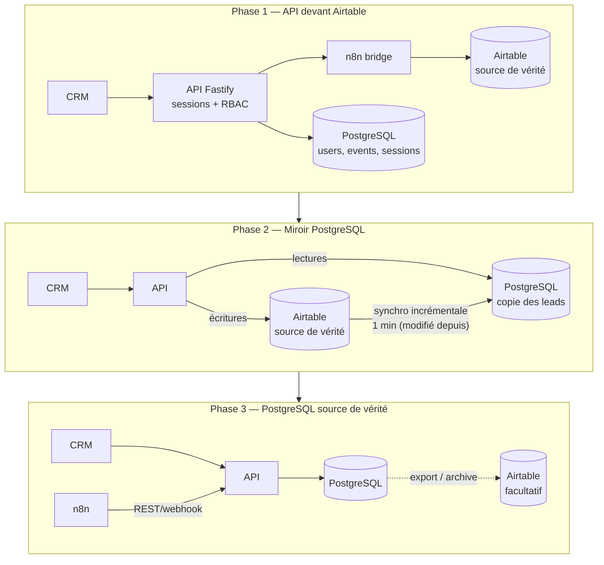
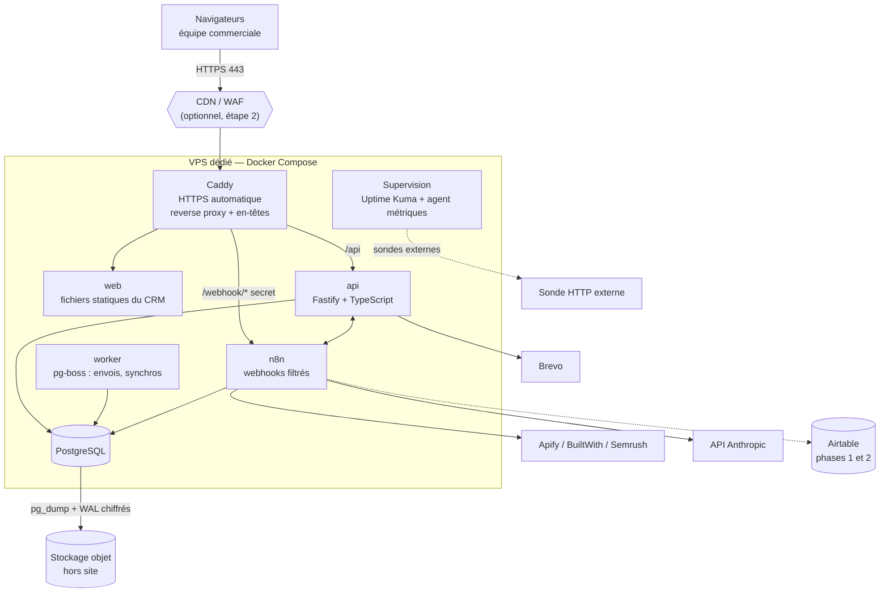
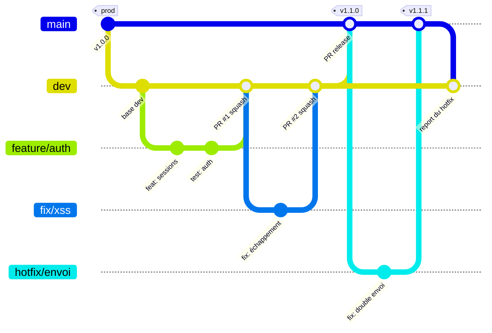
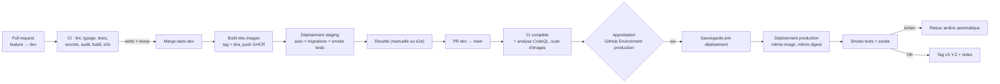
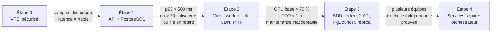

# 05 — Stratégie d'amélioration et de déploiement à grande échelle : GAC Pilot

> ℹ️ **Contexte (octobre 2026).** Cette stratégie a été retenue ; la décision « sortie d'Airtable » est appliquée de façon directe (voir [10](10-sortie-airtable-n8n.md)) et le socle est livré (phase 1 de la [feuille de route](07-feuille-de-route.md)). Le déploiement suit le modèle `deploy.sh` des projets Lingora et Inventory plutôt qu'une promotion d'images GHCR : c'est plus simple à exploiter ; la promotion d'image reste une amélioration possible.


| | |
|---|---|
| **Version** | 1.0 |
| **Base d'analyse** | Dépôt `growthlab-agency-crm` (commit `7817213`) + workflow n8n `Lead Pilot` (WF) — voir [01](01_conception_produit.md) à [04](04_architecture_technique_et_systeme.md) |
| **Légende** | **[Obs]** constaté dans le dépôt/WF · **[Hyp]** hypothèse à vérifier par mesure ou test · **[Reco]** recommandation · **[Déc]** décision à prendre |
| **Tailles d'effort** | **S** ≈ quelques jours · **M** ≈ 1 à 3 semaines · **L** ≈ 1 à 2 mois · **XL** > 2 mois — pour **un** développeur, ordre de grandeur à recalibrer après un premier incrément. Aucun coût en euros n'est annoncé : les tarifs VPS/SaaS sont à relever chez les fournisseurs. |

---

## 0. Synthèse et parti pris

**Diagnostic.** GAC Pilot fait aujourd'hui bien une chose : un tableur de pilotage commercial rapide à utiliser, sans base propre. Sa limite n'est pas la technologie d'affichage, c'est **l'absence de socle serveur** : pas d'utilisateurs, pas d'historique, pas de pagination serveur, des données qui transitent par Airtable puis n8n à chaque rafraîchissement, et une automatisation d'envoi d'emails dont la sécurité et la fiabilité sont fragiles ([03 §9](03_cahier_des_charges.md)).

**Parti pris.** Faire évoluer **par étapes, sans réécriture totale**, et ne changer une technologie que si une limite est constatée ou si un seuil mesuré l'exige :

1. **Un monolithe modulaire** (API + tâches de fond dans un même dépôt) devant une **base PostgreSQL**, déployé en **Docker Compose sur un seul VPS** — suffisant pour un outil interne de quelques utilisateurs et de plusieurs dizaines de milliers de leads **[Hyp à valider, §5.6]**.
2. **Migration progressive de la donnée** (méthode « étrangleur ») : le CRM parle d'abord à la nouvelle API, qui s'appuie encore sur Airtable ; Airtable cesse d'être la source de vérité seulement quand les mesures le justifient.
3. **n8n conservé** pour l'orchestration d'intégrations (Apify, BuiltWith, Semrush, Claude, Brevo), mais **sécurisé, versionné et déplacé sur le VPS** ; la logique critique (planification d'envoi, anti-doublon) migre vers l'API quand elle devient trop risquée à garder dans des nœuds « Wait ».
4. **Pas de microservices ni de Kubernetes** tant que les critères du §5.5 ne sont pas remplis.



---

## 1. Améliorations du projet

Chaque ligne renvoie à un constat du dépôt ou du workflow. Priorité : **P0** avant mise en production · **P1** court terme · **P2** moyen terme.

### 1.1 Sécurité (tout est P0 tant que les emails partent vers de vrais prospects)

| # | Problème **[Obs]** | Solution **[Reco]** | Bénéfice | Effort | Prio |
|---|---|---|---|---|---|
| SEC-A | Jeton Apify (6 nœuds) et clé Anthropic en clair dans WF | Révoquer, régénérer, stocker comme identifiants n8n ; scan de secrets en CI (gitleaks) sur le dépôt **et** sur tout export de workflow | Supprime le risque de fuite et de facturation frauduleuse | S | P0 |
| SEC-B | Nœud d'envoi « TEST MODE » dont le destinataire est l'email du lead ; note contradictoire | Variable `SEND_MODE=test|prod` : destinataire, préfixe d'objet et expéditeur dépendent d'elle ; nœud renommé | Élimine le risque d'envoi involontaire (ou d'absence d'envoi) | S | P0 |
| SEC-C | Webhook `search-leads` sans authentification | En-tête secret vérifié par n8n (Header Auth) et envoyé par l'API ; webhook inaccessible depuis Internet sauf via le reverse proxy filtré | Bloque les exécutions Apify payantes non autorisées | S | P0 |
| SEC-D | Aucune garde anti double envoi (trigger rejouable, envoi différé de plusieurs jours) | Statut `en_file` posé **avant** l'attente ; l'envoi vérifie `email_envoye_le IS NULL` ; idempotence côté Brevo si disponible ❓ | Évite le pire incident commercial (même email deux fois) | S–M | P0 |
| SEC-E | Mot de passe unique, stocké en clair dans `localStorage`, comparé avec `!==`, sans limitation | Comptes nominatifs, cookie de session `HttpOnly; Secure; SameSite=Lax`, hachage argon2id, limitation de débit, TOTP en option, rôles Admin/Commercial | Traçabilité, révocation, fin du mot de passe partagé | M | P0 |
| SEC-F | Trois rendus non échappés (tâches, libellés de secteur, pastilles) ; champs « readonly » seulement côté interface | Rendu par composants (échappement par défaut) ; liste blanche de champs modifiables **côté serveur** par rôle | Ferme l'XSS (donnée issue de scraping) et la modification de champs protégés | S (correctif) / inclus dans M | P0 |
| SEC-G | Pas de CSP/HSTS ; polices Google chargées à l'exécution | Caddy : CSP stricte, HSTS, `Permissions-Policy` ; polices auto-hébergées | Défense en profondeur ; moins de dépendances tierces (RGPD) | S | P1 |
| SEC-H | Aucune politique RGPD/ePrivacy visible ; l'email envoyé est volontairement « sobre » (sans lien) | Mention d'opposition en texte dans chaque email, en-tête `List-Unsubscribe` si Brevo le permet ❓, registre de traitement, durée de conservation, procédure d'effacement | Conformité de la prospection B2B | S–M (technique) + avis juridique | P0 |

### 1.2 Fonctionnalités

| # | Problème | Solution | Bénéfice | Effort | Prio |
|---|---|---|---|---|---|
| FON-A | Utilisateurs statiques ([02 EXG-F-081/082]) | Table `users`, rôles, `Responsable` renseigné automatiquement | Qui fait quoi ; filtres « mes leads » | M | P0 (lié à SEC-E) |
| FON-B | Aucun historique : impossible de mesurer délais et conversion | Table `lead_events` (changement d'étape, validation, appel, envoi) alimentée par l'API | KPI réels (taux de réponse, délai validation → contact), audit | M | P1 |
| FON-C | Sourcing sans retour d'état ; attente fixe 3 min | Table `sourcing_runs` (en attente / en cours / terminé / en erreur, nombre de leads, coût estimé) ; n8n rappelle l'API | L'utilisateur sait quand ses leads arrivent ; détection des échecs | M | P1 |
| FON-D | `pack_cible`, segment et services secondaires calculés mais perdus ; packs ≠ entre WF et CRM | Un **catalogue unique** (table `packs`, `qualifications`, `stages`) lu par l'API, le CRM et injecté dans le prompt | Vocabulaire cohérent, scoring exploitable | M | P1 |
| FON-E | Qualifications `À qualifier - Sans site web` / `ERREUR_PARSING` invisibles dans le CRM | Valeurs ajoutées au catalogue ; file « à reprendre » pour les erreurs de scoring | Aucun lead perdu | S | P1 |
| FON-F | Demandes de contact non branchées | Endpoint public protégé (anti-spam, captcha) → table `inbound_requests` → vue dédiée | Entrants traités | M | P2 |
| FON-G | Pas de dé-duplication ni de fusion (clés `Site web`/`Email` seulement) | Normalisation (domaine, email, téléphone) + vue « doublons possibles » | Qualité des données | M | P2 |

### 1.3 Expérience utilisateur

| # | Problème | Solution | Bénéfice | Effort | Prio |
|---|---|---|---|---|---|
| UX-A | Rafraîchissement par rechargement complet toutes les 25 s ; tableau reconstruit en `innerHTML` | Pagination/tri/filtre **côté serveur**, mises à jour ciblées (SSE ou rafraîchissement conditionnel), mises à jour optimistes avec annulation | Réactivité constante quel que soit le volume | M–L (avec l'API) | P1 |
| UX-B | 55 colonnes affichées sans vues enregistrées | Vues enregistrées par utilisateur (colonnes, filtres, tri), colonnes par rôle | Moins de défilement horizontal, onboarding | M | P2 |
| UX-C | Accessibilité : aucun `aria-*`, pas de `lang`, glisser-déposer seul | Composants accessibles, alternative clavier du Kanban, contrastes audités | Conformité RGAA/WCAG, utilisabilité | M | P1 |
| UX-D | Perte silencieuse possible si colonne absente / réseau | Contrat de données typé (schéma partagé) ; file d'écritures avec nouvelle tentative et indicateur d'état | Plus d'écriture perdue | M | P1 |
| UX-E | Mobile limité (barre latérale masquée) | Vue mobile dédiée aux appels (liste + fiche + changement de statut) | Usage terrain du commercial | M | P2 |

### 1.4 Qualité du code, performances, maintenabilité

| # | Problème **[Obs]** | Solution | Bénéfice | Effort | Prio |
|---|---|---|---|---|---|
| QUA-A | Monolithe de ≈ 2 200 lignes, zéro test, build par substitutions textuelles (8 ancres) | Projet Vite + TypeScript ; extraction de la logique pure (segmentation, mapping STATUT, KPI, aperçu d'email) en modules testés (Vitest) | Régressions détectées, relecture facile | M | P0 (tests minimaux) / P1 (migration complète) |
| QUA-B | Double cible artifact Claude / site hébergé | **Abandonner la compatibilité artifact** (décision ARB-4) | Supprime `build_site.py` et le « shim » `makeDb` | S | P1 |
| QUA-C | Gabarit d'email dupliqué (CRM vs n8n) | Rendu **unique côté API** (`POST /emails/preview`), utilisé aussi pour l'envoi | Fin de la dérive aperçu ≠ envoi | S–M | P1 |
| PER-A | Chaque client recharge tout à chaque 25 s. **Calcul à valider [Hyp]** : si `crm-bridge-list` lit Airtable par pages de 100 enregistrements, une lecture de L leads coûte ≈ L/100 appels ; avec C clients rafraîchissant toutes les 25 s : **(L/100) × C / 25 appels/s**. Pour L = 5 000 et C = 3, ≈ 6 appels/s, à comparer à la limite documentée par Airtable (5 requêtes/s par base, à vérifier sur votre plan) | Lecture depuis PostgreSQL, requêtes paginées et indexées, delta (`modifié depuis`) | Latence stable et coût Airtable nul | M–L | P1 |
| PER-B | Écritures groupées : 4 requêtes parallèles via n8n→Airtable | Mise à jour SQL transactionnelle (une requête) ; mirroring Airtable asynchrone si conservé | Actions groupées quasi instantanées, atomiques | M | P1 |
| MAI-A | Aucune CI, déploiement manuel `netlify-cli@latest`, chemins locaux en dur | Pipeline GitHub Actions (§4), images Docker versionnées | Déploiements reproductibles, retour arrière | M | P0 |
| MAI-B | Workflows n8n non versionnés (et avec secrets) | Export expurgé (`n8n export:workflow` sans identifiants) commité, revue en PR, import automatisé | Historique, revue, reprise après sinistre | S–M | P0 |
| MAI-C | Pas d'observabilité | Journaux JSON structurés, `/healthz`, alertes d'échec n8n, suivi d'erreurs navigateur et API | Détecter avant l'utilisateur | M | P1 |

---

## 2. Technologies et architecture cible

### 2.1 Principes de choix

- **Taille de l'équipe et du produit** : outil interne, peu d'utilisateurs simultanés **[Hyp]**. Chaque composant ajouté doit se justifier par un problème constaté.
- **Une langue pour le code applicatif** (TypeScript) afin de partager types et validations entre front et API ; le dépôt actuel est déjà en JavaScript.
- **Peu de composants à exploiter** sur un VPS unique : PostgreSQL peut aussi servir de file de tâches avant d'introduire Redis.
- **Réversibilité** : chaque migration a une porte de sortie et un critère de déclenchement mesuré.

### 2.2 Tableau d'évaluation

| Couche | Technologie actuelle | Limites **observées [Obs]** / **anticipées [Hyp]** | Recommandation | Conserver ou remplacer — raisons | Coût et conséquences de la migration |
|---|---|---|---|---|---|
| **Frontend** | HTML/CSS/JS vanilla monolithique (≈ 2 200 lignes), rendu par `innerHTML`, aucun test | [Obs] XSS partiels, 0 test, état global implicite, rebuild complet du DOM, accessibilité absente. [Hyp] la grille à 55 colonnes devient lente avec de grosses pages | **Étape 1** : Vite + TypeScript, modules + tests (en gardant le rendu actuel). **Étape 2** : React + TanStack Query (cache serveur) + TanStack Table (virtualisation) pour les vues Leads/Sourcing ; Kanban avec dnd-kit | **Remplacer progressivement.** Vue et Svelte conviendraient aussi ; React est retenu pour l'écosystème (grille, accessibilité, recrutement). Le framework n'est justifié que par la grille éditable, le Kanban accessible et les tests de composants — pas par la taille de l'écran | L au total, mais incrémental vue par vue (Dashboard → Pipeline → Leads). Risque : régression de la grille (recopie, copie Sheets, filtres Excel) → la reconstruire en dernier, avec ses tests |
| **Backend / API** | 1 fonction Netlify (`bridge.js`) : mot de passe + relais n8n | [Obs] aucune logique métier, pas d'utilisateurs, pas de validation, pas de journal. [Hyp] cold starts et limites de durée serverless sans objet sur un VPS | **Node.js (LTS) + TypeScript + Fastify** (ou Hono), validation par schémas (Zod/TypeBox), ORM léger (Drizzle ou Kysely), OpenAPI généré | **Remplacer** le pont par une API stateful. Alternatives : Python/FastAPI (cohérent avec `build_site.py` mais deux langages) ; NestJS (plus lourd) ; Go (performant mais coût d'équipe). Fastify = plus petit coût d'entrée, assez rapide | M. Contrat `/api/{leads,update,…}` conservé au départ pour ne pas casser le front |
| **Base de données** | Airtable « Lead Pilot » via n8n | [Obs] pas de pagination/filtre serveur exposé, pas d'historique, pas de transactions, validation de schéma par message d'erreur (`UNKNOWN_FIELD_NAME`). [Hyp] limites de débit (5 req/s/base documentées), plafond d'enregistrements selon le plan, coût par siège — **à vérifier sur votre abonnement** | **PostgreSQL** (version majeure supportée la plus récente validée), migrations versionnées, index sur (étape, qualification, validation, date) | **Remplacer en 3 phases** (§2.3). Alternatives : SQLite + Litestream (très simple, mais écritures concurrentes et montée en charge limitées) ; NocoDB/Baserow/Directus (interface « tableur » sur Postgres : seulement si un accès non développeur à la donnée brute reste indispensable) ; garder Airtable (acceptable tant que les volumes restent petits **et** que le cache est en place) | M–L. Risques : dérive de schéma pendant la double écriture, types de champs (listes à choix multiples), pièces jointes éventuelles ❓. Gain : requêtes, historique, intégrité, coût stable |
| **Stockage de fichiers** | Aucun (pas de fichiers dans le dépôt) | [Hyp] besoin futur : exports CSV volumineux, sauvegardes, éventuelles pièces jointes | **Stockage objet S3-compatible** (fournisseur européen au choix) pour sauvegardes chiffrées et exports ; pas de stockage local applicatif | **Ajouter plus tard.** Sauvegardes hors site dès l'étape 1 ; fichiers métier seulement si une fonctionnalité l'exige | S. Un seul client S3 à configurer |
| **Cache** | Aucun (rechargement complet) | [Obs] pas de cache. [Hyp] la base PostgreSQL bien indexée suffit pour des dizaines de milliers de lignes | **Pas de cache applicatif au départ.** ETag/`If-None-Match` + cache navigateur ; Redis seulement pour limitation de débit distribuée, sessions partagées ou file BullMQ | **Ne pas ajouter maintenant.** Un cache masquerait une mauvaise requête et ajoute un composant à exploiter | S si besoin ultérieur |
| **Tâches de fond** | n8n (Wait de plusieurs jours, attentes fixes), planifications n8n | [Obs] exécutions longues retenues en mémoire, jointures par position, erreurs absorbées, pas de reprise. [Hyp] charge d'exécutions n8n à vérifier | **pg-boss** (file de tâches sur PostgreSQL) pour : planification des envois (créneaux), synchronisations, anti-doublon, rappels, exports. **n8n conservé** pour le sourcing/enrichissement | **Scinder.** Orchestration d'API tierces = n8n ; logique métier critique à état = code testé. BullMQ + Redis seulement si la file dépasse les capacités de pg-boss (§5) | M. Migration de la chaîne « Envoi » d'abord (la plus risquée) |
| **Files de messages** | Aucune | [Hyp] pas de besoin avant plusieurs services | **Pas de broker dédié.** La file de tâches PostgreSQL suffit ; RabbitMQ/Kafka injustifiés | **Ne pas ajouter.** | — |
| **Temps réel** | Interrogation toutes les 25 s | [Obs] charge proportionnelle au nombre de clients | **Server-Sent Events** (flux unidirectionnel simple) ou rafraîchissement ciblé par `since=` | **Remplacer** si UX-A l'exige ; sinon garder une interrogation conditionnelle | S–M |
| **Authentification** | Mot de passe unique | [Obs] voir SEC-E | Sessions serveur + argon2id (+ TOTP) ; SSO (OIDC) plus tard si l'agence a un fournisseur d'identité | **Remplacer.** Pas de Keycloak/Auth0 pour < 20 utilisateurs (coût d'exploitation ou abonnement non justifié) | M |
| **Hébergement** | Netlify (statique + fonction) | [Obs] deux origines (cookie de session difficile), pas de contrôle réseau. [Hyp] coût et limites du plan | **VPS + Docker Compose + Caddy** (décision déjà prise) | **Remplacer** conformément au contexte | M |
| **Orchestrateur** | n8n sur instance non décrite ❓ | [Obs] webhooks publics, secrets en clair, stockage inconnu | n8n **auto-hébergé sur le VPS**, base PostgreSQL (pas SQLite), clé de chiffrement des identifiants (`N8N_ENCRYPTION_KEY`) sauvegardée, éditeur non exposé publiquement | **Conserver** (il fait bien l'intégration) mais le durcir | S–M |
| **Emailing** | Brevo (transactionnel + liste) | [Obs] mise à jour de tous les leads validés toutes les 10 min ; statuts de retour non vus ❓ | **Conserver Brevo**, ajouter webhooks Brevo → API (événements délivré/ouvert/bounce/désinscrit) | **Conserver.** Remplacer n'apporterait rien tant qu'aucun problème de délivrabilité n'est mesuré | S–M |

### 2.3 Migration de la donnée en trois phases (méthode « étrangleur »)



**Portes de passage (à mesurer, pas à supposer)**
- Phase 1 → 2 : p95 de lecture des leads par le pont > 1 s, ou erreurs 429 d'Airtable, ou besoin de recherche/tri serveur.
- Phase 2 → 3 : plus aucune consommation directe d'Airtable hors n8n, 2 semaines de réconciliation sans écart, volume proche du plafond de l'abonnement Airtable, ou besoin d'historique transactionnel.
- Retour arrière à chaque phase : désactiver le miroir ; Airtable reste lisible jusqu'à la phase 3.

### 2.4 Architecture cible (étape 1, un seul VPS)



---

## 3. Déploiement sur le VPS

### 3.1 Dimensionnement : scénarios et hypothèses

Les volumes réels, le budget et les caractéristiques du VPS ne sont **pas connus**. Scénarios de travail (**[Hyp]**, à confirmer avec le §3.9 et le plan de test §5.6) :

| Scénario | Utilisateurs simultanés | Leads en base | Sourcing | Taille de VPS de départ à tester |
|---|---|---|---|---|
| **A — Lancement** | ≤ 5 | ≤ 20 000 | quelques centaines de leads par semaine | 2 vCPU, 4 Go de RAM, disque SSD ≥ 40 Go |
| **B — Croissance** | 5 à 20 | 20 000 à 200 000 | milliers de leads par mois, plusieurs lots en parallèle | 4 vCPU, 8 Go de RAM, disque ≥ 80 Go |
| **C — Intensif** | 20 à 50+ | > 200 000 | quotidien, plusieurs équipes | à répartir (§5) |

Ces tailles sont des **points de départ à mesurer**, pas des garanties : la consommation réelle de n8n (exécutions longues), de PostgreSQL et de la compilation d'images en CI doit être observée pendant la phase de test.

### 3.2 Conteneurisation

- **Docker Compose** avec un projet par environnement (`gac-prod`, `gac-staging`), images construites en CI et poussées sur GitHub Container Registry, déployées **par empreinte (digest)**, jamais par `latest`.
- Services : `caddy`, `web`, `api`, `worker`, `postgres`, `n8n`, `uptime-kuma` (+ `redis` seulement à l'étape où il se justifie).
- Réseaux Docker : un réseau interne pour `postgres`/`n8n`/`api`/`worker` ; seul `caddy` publie 80/443. **Jamais** de port PostgreSQL ouvert sur Internet.
- Limites de ressources (mémoire/CPU) par conteneur pour éviter qu'un traitement n8n ne prive PostgreSQL de RAM ; `restart: unless-stopped`, `healthcheck` sur chaque service.

### 3.3 Reverse proxy et HTTPS

**Caddy** (retenu) : certificats Let's Encrypt automatiques, HTTP/2-3, configuration courte. Alternatives : Traefik (utile si beaucoup de conteneurs dynamiques), Nginx (plus manuel). Règles : redirection HTTP→HTTPS, HSTS, CSP, compression, limitation de débit sur `/api/auth/*`, `/webhook/*` accessible uniquement avec en-tête secret ou liste d'IP des services appelants, éditeur n8n sur un sous-domaine protégé (IP autorisées ou VPN/Tailscale).

### 3.4 Environnements et configuration

| Environnement | Où | Données | Rôle |
|---|---|---|---|
| **local** | poste développeur (`docker compose` + données factices) | jeu de données synthétique | développement |
| **staging** | même VPS au départ (projet Compose distinct, sous-domaine `staging.`, ressources plafonnées) **ou** second petit VPS dès que possible | copie **anonymisée** de la prod (jamais de vrais prospects) ; n8n en `SEND_MODE=test` vers une boîte de test | recette avant production |
| **production** | VPS dédié | vraies données | exploitation |

Configuration : variables d'environnement validées au démarrage (échec explicite si absentes), un fichier `.env` par environnement hors Git.

### 3.5 Gestion des secrets

1. Secrets de déploiement dans **GitHub Environments** (`staging`, `production`) avec relecteurs obligatoires pour `production`.
2. Le pipeline dépose `/opt/gac/<env>/.env` (permissions `600`, propriétaire du service) ; aucun secret dans les images ni dans Git.
3. Étape suivante possible : **SOPS + age** (secrets chiffrés versionnés) pour reconstruire un VPS à l'identique.
4. Rotation documentée : mot de passe de base, `N8N_ENCRYPTION_KEY` (à sauvegarder séparément : sans elle, les identifiants n8n sont perdus), clés Apify/Anthropic/Brevo/Airtable, secret de pont.
5. Scan de secrets en CI et via la protection native de GitHub (push protection).

### 3.6 Données persistantes et sauvegardes

| Donnée | Emplacement | Sauvegarde | Fréquence proposée |
|---|---|---|---|
| PostgreSQL (CRM + n8n) | volume Docker nommé sur disque dédié | `pg_dump` chiffré quotidien **+** archivage WAL (pgBackRest ou WAL-G) pour la restauration à un instant donné | quotidien ; WAL continu à partir du scénario B |
| Workflows n8n | dépôt Git (export expurgé) | Git | à chaque PR |
| `N8N_ENCRYPTION_KEY`, `.env` | VPS | coffre de mots de passe de l'équipe | à chaque rotation |
| Configuration serveur | dépôt (`infra/`) | Git | à chaque PR |
| Images Docker | registre GitHub | conservation des N dernières versions | continue |

Règles : sauvegardes **hors du VPS** (stockage objet d'un autre fournisseur ou d'une autre région), chiffrées (restic ou rclone + age), rétention (ex. 7 quotidiennes, 4 hebdomadaires, 6 mensuelles) à valider avec la politique de conservation RGPD. **Une sauvegarde non restaurée n'est pas une sauvegarde** : test de restauration automatisé mensuel dans l'environnement de staging, avec mesure du temps réel.
Objectifs proposés **[Déc]** : RPO 24 h puis ≤ 15 min (WAL), RTO 4 h puis 1 h — à arbitrer selon l'impact d'une indisponibilité pour l'activité commerciale.

### 3.7 Supervision

| Besoin | Outil de départ | Quand monter en gamme |
|---|---|---|
| Disponibilité externe, certificat | Uptime Kuma + une sonde externe indépendante du VPS | — |
| CPU/RAM/disque/conteneurs | Netdata ou cAdvisor + Prometheus, tableaux Grafana (ou offre gratuite d'un service hébergé) | dès le scénario B |
| Journaux | Docker `json-file` avec rotation, puis Loki ou service hébergé | quand la recherche inter-services devient pénible |
| Erreurs applicatives (front + API) | GlitchTip (compatible Sentry, auto-hébergeable) ou Sentry hébergé | dès l'étape 1 |
| Échecs n8n | workflow « Error Trigger » → notification (email/messagerie) | dès l'étape 0 |
| Alertes | disque > 80 %, RAM > 85 %, sauvegarde absente depuis 26 h, certificat < 14 j, taux d'erreur 5xx, file de tâches en retard | dès l'étape 1 |

### 3.8 Durcissement du serveur

Accès SSH par clés uniquement, utilisateur de déploiement non root, pare-feu (ufw/nftables : 22 restreint, 80, 443), Fail2ban ou CrowdSec, mises à jour de sécurité automatiques, SELinux/AppArmor par défaut du système, Docker sans exposition du socket, images minimales (distroless/alpine) scannées par Trivy, instantané du VPS avant chaque changement majeur.

### 3.9 Ce qui tient sur un seul VPS — et ce qui ne tient pas

| Fonctionne bien | Risque associé | Mitigation |
|---|---|---|
| API + PostgreSQL + n8n + Caddy pour le scénario A et probablement B **[Hyp]** | **Point unique de défaillance** : panne matérielle, erreur d'administration, saturation disque | Sauvegardes hors site testées, instantanés, procédure de reconstruction scriptée (IaC léger : Ansible ou script `bootstrap.sh` + Compose) |
| Staging sur le même hôte | Concurrence pour les ressources, risque de contaminer la prod | Limites de ressources, ports et réseaux distincts, staging éteignable ; second VPS dès que possible |
| PostgreSQL et n8n sur le même disque | I/O partagés, un workflow mal conçu ralentit la base | Disque/volume dédié à PostgreSQL, limites mémoire, surveiller le iowait |
| Déploiement avec redémarrage | Brève indisponibilité (secondes) | Déploiement « recréer puis basculer » (`up -d --wait`), migrations compatibles (§4.5) |
| Sourcing et enrichissement (Apify, Semrush…) | Débordement de coûts et de durée | Quotas par utilisateur/jour, journal de coût, arrêt automatique |

**À externaliser en premier, dans cet ordre** : (1) sauvegardes hors site ; (2) sonde de disponibilité externe ; (3) CDN/WAF devant le site ; (4) staging sur un second hôte ; (5) base de données (managée ou serveur dédié) ; (6) worker sur un autre hôte ; (7) second nœud d'API derrière un répartiteur.

---

## 4. Workflow GitHub et CI/CD

### 4.1 Modèle de branches



- `main` = production ; `dev` = intégration/staging ; branches de travail `feature/*`, `fix/*`, `hotfix/*`, `chore/*`.
- **Protections** : pas de push direct sur `main` et `dev` ; PR obligatoire ; vérifications requises à jour avec la branche ; 1 relecture minimum (2 pour `main` quand l'équipe le permet) ; `CODEOWNERS` sur `infra/`, `.github/`, `workflows-n8n/`, migrations ; historique linéaire (squash) ; signatures de commits recommandées.
- **Versions** : étiquettes sémantiques `vMAJEUR.MINEUR.CORRECTIF` créées sur `main` ; notes de version générées.
- **Hotfix** : branche depuis `main`, PR vers `main`, puis report vers `dev`.

### 4.2 Pipeline



**Principe clé : « construire une fois, promouvoir »** — l'image testée en staging est exactement celle qui part en production.

### 4.3 Vérifications automatiques (checks requis)

| Étape | Outils proposés | Bloquant |
|---|---|---|
| Format et lint | Biome ou ESLint + Prettier | Oui |
| Typage | `tsc --noEmit` | Oui |
| Tests unitaires | Vitest (segmentation, mapping STATUT, KPI, aperçu d'email, règles RG-xx) | Oui |
| Tests d'intégration API | Vitest + PostgreSQL éphémère (service de job ou Testcontainers) ; contrat OpenAPI | Oui |
| Tests de bout en bout | Playwright (Chromium) sur la pile Compose de test : connexion, validation d'email, glisser-déposer, action groupée | Oui sur PR vers `main`, sinon nocturne |
| Migrations | rejouer sur une base vide **et** sur un instantané de staging | Oui |
| Secrets | gitleaks sur le diff + sur `workflows-n8n/` ; push protection GitHub | Oui |
| Dépendances | `npm audit`/Dependabot (ou Renovate), licence | Alerte ; bloquant si critique |
| Analyse statique | CodeQL | Oui sur `main` |
| Images | Trivy (vulnérabilités critiques), Dockerfile lint (hadolint) | Oui sur `main` |
| Accessibilité | axe via Playwright sur les vues principales | Alerte, puis bloquant |
| Performance | k6 « smoke » (30 s) sur staging | Alerte ; scénario complet hors PR (§5.6) |

### 4.4 Squelettes de workflows (à adapter)

`.github/workflows/ci.yml`
```yaml
name: CI
on:
  pull_request:
    branches: [dev, main]
permissions:
  contents: read
concurrency:
  group: ci-${{ github.ref }}
  cancel-in-progress: true
jobs:
  checks:
    runs-on: ubuntu-latest
    services:
      postgres:
        image: postgres:17
        env: { POSTGRES_PASSWORD: ci, POSTGRES_DB: gac_test }
        ports: ["5432:5432"]
        options: >-
          --health-cmd "pg_isready -U postgres" --health-interval 5s --health-retries 10
    steps:
      - uses: actions/checkout@v4
      - uses: actions/setup-node@v4
        with: { node-version-file: .nvmrc, cache: npm }
      - run: npm ci
      - run: npm run lint && npm run typecheck
      - run: npm test -- --coverage
        env: { DATABASE_URL: postgres://postgres:ci@localhost:5432/gac_test }
      - uses: gitleaks/gitleaks-action@v2
      - run: npx playwright install --with-deps chromium && npm run e2e
```

`.github/workflows/deploy.yml` (extrait — staging sur `dev`, production sur `main` avec approbation)
```yaml
name: Deploy
on:
  push:
    branches: [dev, main]
jobs:
  build:
    runs-on: ubuntu-latest
    permissions: { contents: read, packages: write }
    outputs: { tag: ${{ steps.meta.outputs.tag }} }
    steps:
      - uses: actions/checkout@v4
      - id: meta
        run: echo "tag=${GITHUB_SHA::12}" >> "$GITHUB_OUTPUT"
      - uses: docker/login-action@v3
        with: { registry: ghcr.io, username: ${{ github.actor }}, password: ${{ secrets.GITHUB_TOKEN }} }
      - uses: docker/build-push-action@v6
        with: { context: ., push: true, tags: "ghcr.io/${{ github.repository }}/app:${{ steps.meta.outputs.tag }}" }
  deploy:
    needs: build
    runs-on: ubuntu-latest
    environment: ${{ github.ref_name == 'main' && 'production' || 'staging' }}   # relecteurs requis en production
    steps:
      - uses: actions/checkout@v4
      - name: Déploiement
        env:
          SSH_KEY: ${{ secrets.DEPLOY_SSH_KEY }}
          HOST: ${{ vars.DEPLOY_HOST }}
          ENVNAME: ${{ github.ref_name == 'main' && 'prod' || 'staging' }}
          TAG: ${{ needs.build.outputs.tag }}
        run: |
          install -m 600 /dev/null key && printf '%s\n' "$SSH_KEY" > key
          ssh -i key -o StrictHostKeyChecking=yes deploy@"$HOST" "/opt/gac/bin/deploy.sh $ENVNAME $TAG"
```
`deploy.sh` (sur le VPS) : sauvegarde pré-déploiement (prod) → `docker compose pull` → migrations en tâche unique → `docker compose up -d --wait` → smoke tests → en cas d'échec, `rollback.sh` vers le tag précédent. La clé SSH de déploiement est restreinte (`command=` dans `authorized_keys`) à ce seul script.

### 4.5 Retour à la version précédente

1. **Applicatif** : le script conserve `previous_tag` ; `rollback.sh <env> [tag]` relance les images précédentes (conservées dans GHCR) en moins de quelques minutes. Déclenchable à la main via un workflow `Rollback` (`workflow_dispatch`) avec approbation.
2. **Base de données** : migrations en **expand / contract** — d'abord ajouter (colonnes nullables, nouvelles tables), basculer le code, puis supprimer dans une version ultérieure. Une version N-1 doit toujours fonctionner avec le schéma de N. Aucune migration destructive dans le même déploiement que le code qui l'utilise.
3. **Cas extrême** : restauration de la sauvegarde pré-déploiement (point dans le temps) — procédure répétée en staging, durée mesurée.
4. **n8n** : workflows réimportés depuis le tag Git correspondant ; l'export est versionné avec le code qui en dépend (`workflows-n8n/`).
5. **Critères de retour arrière automatique** : échec du `healthcheck`, du smoke test, ou taux d'erreurs 5xx > seuil dans les 10 minutes suivant le déploiement.

---

## 5. Montée en charge progressive

### 5.1 Étape 0 — Sécuriser et poser l'existant sur le VPS

**Changements** : SEC-A à SEC-D ; conteneurisation de `bridge.js` (même contrat), de `index.html` statique et de n8n ; Caddy + HTTPS ; sauvegardes hors site ; CI minimale ; alertes d'échec n8n.
**Pourquoi d'abord** : réduit les risques réels (clés exposées, envois) sans toucher au produit.
**Passage à l'étape 1** : décision de produit (comptes, historique) ou premier incident de performance lié à Airtable.

### 5.2 Étape 1 — Lancement : API, comptes, PostgreSQL (un VPS)

**Changements** : API Fastify avec sessions et rôles ; PostgreSQL (`users`, `lead_events`, `sourcing_runs`, catalogue) ; phase 1 de la migration de données ; worker pg-boss pour la planification d'envoi ; Vite + TypeScript + tests.
**Indicateurs à suivre** (valeurs de départ **[Hyp]**, à calibrer) :

| Indicateur | Seuil d'attention | Action |
|---|---|---|
| p95 de `GET /leads` (page de 50) | > 500 ms durablement | index, requête, passage phase 2 |
| Appels Airtable | > 60 % de la limite documentée du plan | cache + miroir (phase 2) |
| CPU | > 70 % moyenne 15 min | profiler avant d'agrandir |
| RAM utilisée | > 80 % | limites par conteneur, sizing |
| Connexions PostgreSQL | > 60 % de `max_connections` | pool, PgBouncer |
| Disque | > 70 % ou croissance qui l'épuise en < 90 jours | purge, volume, archive |

### 5.3 Étape 2 — Croissance : isoler les charges (toujours un VPS, ou deux)

**Changements** : lecture depuis le miroir PostgreSQL (phase 2) ; worker dans son propre conteneur voire hôte ; CDN/WAF devant le site ; sauvegardes WAL (PITR) ; staging sur second VPS ; Redis **seulement** si limitation de débit distribuée ou file BullMQ devient nécessaire ; SSE pour le temps réel.
**Déclencheurs** : p95 API > 500 ms malgré les index ; plus de 20 utilisateurs simultanés ; file de tâches avec retard > 5 min ; sourcing simultanés qui ralentissent l'interface ; premier incident d'indisponibilité.
**Indicateurs supplémentaires** : retard de file (âge du plus ancien job), durée d'un lot de sourcing de bout en bout, nombre d'exécutions n8n en attente, taux d'échec des synchronisations Brevo.

### 5.4 Étape 3 — Usage important : base séparée, plusieurs instances

**Changements** : PostgreSQL sur un hôte dédié ou managé (haute disponibilité, sauvegardes gérées) ; deux instances d'API derrière un répartiteur (le front statique via CDN) ; PgBouncer ; réplica de lecture pour les rapports ; stockage objet pour exports ; n8n en mode « queue » (Redis + workers) si les exécutions saturent ; traçabilité distribuée légère (OpenTelemetry).
**Déclencheurs** : CPU de la base > 70 % malgré index et pool ; connexions simultanées proches du plafond de l'API ; RTO exigé < 1 h ; fenêtre de maintenance devenue inacceptable ; volume de données dépassant confortablement la RAM disponible pour le cache de la base **[Hyp]**.

### 5.5 Étape 4 — Services séparés / orchestrateur (seulement si justifié)

À n'envisager que si **plusieurs** de ces conditions sont réunies :
- plusieurs équipes de développement qui se bloquent sur un même dépôt ou cycle de livraison ;
- un domaine (ex. moteur de prospection) dont la charge et le cycle de vie diffèrent radicalement du CRM, avec besoin de mise à l'échelle indépendante prouvé par les mesures ;
- exigences de disponibilité qui imposent des déploiements sans interruption sur plusieurs nœuds ;
- parc d'applications suffisant pour amortir l'exploitation d'un orchestrateur (Kubernetes ou Nomad) et une équipe capable de l'exploiter.

**Tant que ce n'est pas le cas**, un monolithe modulaire scalé verticalement puis horizontalement (étape 3) est moins cher à exploiter et plus simple à déboguer. Dans tous les cas, passer d'abord par **Docker Swarm ou Nomad/Compose multi-hôtes** avant Kubernetes si un orchestrateur devient nécessaire.



### 5.6 Validation de la capacité (aucun chiffre sans mesure)

Aucune capacité n'est annoncée ici : elles se **démontrent** ainsi.

1. **Jeu de données synthétique** à 1×, 5× et 25× le volume attendu (leads réalistes, 55 champs).
2. **Scénarios k6** : (a) consultation de listes paginées et filtrées ; (b) édition simultanée de cellules ; (c) action groupée sur N lignes ; (d) rafraîchissement concurrent par C clients ; (e) lancement de sourcing pendant l'usage normal ; (f) pic de validations simultanées déclenchant des envois.
3. **Mesures** : p50/p95/p99 par route, taux d'erreur, CPU/RAM/iowait, connexions et verrous PostgreSQL, âge de la file, durée de bout en bout d'un lot de sourcing (de l'appel au lead visible).
4. **Critères d'acceptation** à fixer avec les utilisateurs **[Déc]**, par exemple : « page de 50 leads affichée en moins de X ms au p95 avec C utilisateurs » — X et C sont à décider.
5. **Répétition** : à chaque étape et avant chaque changement de taille de VPS ; résultats archivés dans le dépôt.
6. **Test de défaillance** : arrêt de PostgreSQL, de n8n, d'Apify (simulé), restauration complète chronométrée.

---

## 6. Plan d'action priorisé

### 6.1 Indispensable avant la mise en production

| # | Action | Réf. | Effort |
|---|---|---|---|
| 1 | Révoquer/renouveler jeton Apify et clé Anthropic ; secrets en identifiants n8n | SEC-A | S |
| 2 | Lever l'ambiguïté du mode d'envoi (`SEND_MODE`) et confirmer le comportement réel | SEC-B | S |
| 3 | Authentifier `search-leads` ; restreindre l'accès aux webhooks et à l'éditeur n8n | SEC-C | S |
| 4 | Garde anti double envoi + test dédié | SEC-D | S–M |
| 5 | Corriger les rendus non échappés ; liste blanche de champs côté serveur | SEC-F | S |
| 6 | Comptes nominatifs et sessions HttpOnly (ou, au minimum, mot de passe hors `localStorage` + limitation de débit) | SEC-E | M |
| 7 | Mention d'opposition dans les emails, registre de traitement, validation juridique | SEC-H | S–M |
| 8 | VPS durci, Docker Compose, Caddy + HTTPS, pare-feu | §3 | M |
| 9 | Sauvegardes chiffrées hors site **et un test de restauration réussi** | §3.6 | S–M |
| 10 | CI minimale : lint, typage, tests des règles métier, scan de secrets ; branches protégées `dev`/`main` | §4 | M |
| 11 | Staging avec n8n en mode test, boîte de réception de test | §3.4 | S–M |
| 12 | Supervision : sonde externe, alertes disque/sauvegarde, alerte d'échec n8n | §3.7 | S |
| 13 | Procédure d'exploitation (déploiement, retour arrière, incident, rotation de secrets) | §4.5 | S |

### 6.2 Court terme (après la mise en production)

- API Fastify + PostgreSQL phase 1 ; historique des événements ; sessions et rôles complets (FON-A, FON-B).
- Vite + TypeScript, extraction et tests de la logique pure ; abandon de la compatibilité artifact (QUA-A/B).
- Rendu d'email unique côté API (QUA-C) ; retour d'état du sourcing (FON-C) ; catalogue unique de packs/qualifications (FON-D/E).
- n8n : jointures par identifiant, suivi d'état Apify, workflows versionnés (MAI-B).
- Accessibilité (UX-C), CSP/HSTS, polices auto-hébergées (SEC-G).
- Premier plan de test de charge sur jeu synthétique (§5.6).

### 6.3 Lorsque la charge augmente

- Miroir PostgreSQL puis source de vérité (§2.3), pagination serveur, SSE.
- Worker isolé, PITR, CDN/WAF, staging sur second VPS.
- Base dédiée/managée, deux API, PgBouncer, réplica de lecture, n8n en mode queue — uniquement sur dépassement des seuils mesurés.
- Services séparés/orchestrateur : uniquement si les critères du §5.5 sont remplis.

### 6.4 Stack finale recommandée et compromis

| Couche | Choix | Principal compromis |
|---|---|---|
| Frontend | TypeScript + Vite, puis React + TanStack Query/Table | Réécriture de la grille coûteuse ; gain en tests, accessibilité et vitesse d'évolution |
| API | Node.js LTS + Fastify + Zod + Drizzle | Un seul langage mais moins de « batteries incluses » que NestJS/Django |
| Base | PostgreSQL | Exploitation et sauvegardes à notre charge ; fin de l'interface Airtable pour les non-développeurs |
| Tâches | pg-boss (puis BullMQ + Redis si besoin) | Débit inférieur à un broker dédié, mais zéro composant ajouté |
| Orchestration d'intégrations | n8n auto-hébergé (Postgres) | Souplesse visuelle contre revue de code plus difficile ; limiter la logique à état |
| Emailing | Brevo + webhooks de statuts | Dépendance à un fournisseur ; bascule possible via une interface d'envoi unique |
| Proxy / TLS | Caddy | Moins de modules que Nginx/Traefik ; suffisant et plus simple |
| Conteneurs | Docker Compose sur VPS | Pas de haute disponibilité native ; reconstruction scriptée en contrepartie |
| CI/CD | GitHub Actions + GHCR + déploiement SSH contraint | Pas de déploiement progressif (canary) ; simplicité et traçabilité |
| Sauvegardes | pg_dump/WAL + restic vers stockage objet hors site | Restauration à tester régulièrement ; coût de stockage |
| Supervision | Uptime Kuma, Netdata/Prometheus-Grafana, GlitchTip | Plusieurs outils à administrer ; remplaçables par un service hébergé |

**Ce qui est volontairement écarté (et pourquoi)** : Kubernetes (aucun besoin d'orchestration multi-services constaté), microservices (une seule équipe, un seul domaine), Kafka/RabbitMQ (aucun flux d'événements à haut débit), Redis dès le départ (pas de problème que PostgreSQL ne résolve pas), Keycloak/Auth0 (surdimensionné pour < 20 utilisateurs), réécriture complète en une fois (risque et coût élevés sans gain utilisateur immédiat).

---

## 7. Hypothèses, questions ouvertes et décisions à valider

**Hypothèses**
- H1 : l'outil reste interne, avec moins de 50 utilisateurs et des volumes de leads de l'ordre de dizaines à centaines de milliers (non fourni).
- H2 : l'équipe de développement est réduite (1 à 3 personnes) et maîtrise JavaScript/TypeScript.
- H3 : Airtable et n8n existants restent utilisables pendant la migration ; les workflows `crm-bridge-*` non vus se comportent comme `bridge.js` le suppose.
- H4 : le VPS est situé dans l'UE et accessible en SSH avec Docker installable ; le fournisseur de stockage objet hors site est à choisir.
- H5 : toutes les valeurs de seuil (§5) sont des points de départ à calibrer par les tests du §5.6.

**Questions ouvertes**
- Q1 : caractéristiques réelles du VPS (CPU, RAM, disque, réseau, fournisseur, sauvegardes proposées) et budget mensuel acceptable ?
- Q2 : volume actuel/attendu de leads, d'utilisateurs, de sourcing et d'envois par jour ?
- Q3 : plan Airtable (limites d'enregistrements, d'appels, nombre de sièges) et coûts actuels de n8n, Apify, Semrush, Anthropic, Brevo ?
- Q4 : l'envoi vers les vrais prospects est-il actif aujourd'hui ? Quel plafond quotidien et quelle base légale ?
- Q5 : doit-on conserver l'interface Airtable pour des utilisateurs non développeurs après la phase 3 ?
- Q6 : exigences de disponibilité (heures de travail seulement ou 24/7) et RPO/RTO acceptables ?
- Q7 : qui administre le VPS, GitHub, n8n, Brevo ; existe-t-il déjà un fournisseur d'identité (SSO) ?
- Q8 : quels workflows (`crm-bridge-*`, Google Maps, retour de statuts Brevo) faut-il intégrer au dépôt et à la migration ?

**Décisions à valider**
- D1 : adoption de la stratégie « API devant Airtable → miroir → PostgreSQL source de vérité », avec ses portes de passage (§2.3).
- D2 : framework frontend (React proposé) et moment de la migration (après les tests, vue par vue).
- D3 : pg-boss comme file de tâches, n8n limité à l'intégration d'API tierces.
- D4 : modèle de branches `feature → dev → main`, protections et approbations de production (§4.1).
- D5 : staging sur le même VPS au départ ou second hôte immédiat.
- D6 : objectifs RPO/RTO et politique de conservation des sauvegardes.
- D7 : critères d'acceptation de performance (X ms, C utilisateurs) pour la recette de charge.
- D8 : abandon de la compatibilité « artifact Claude » ([03 ARB-4](03_cahier_des_charges.md)).
