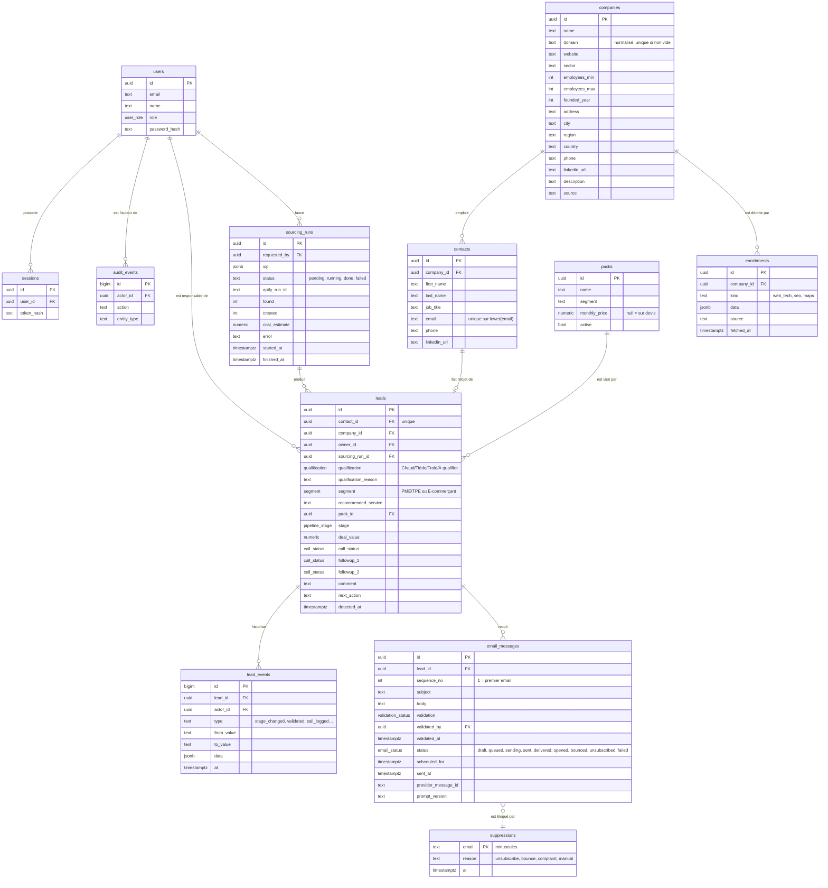

# 06 — Modèle de données PostgreSQL

| | |
|---|---|
| **Statut** | Socle (phase 1) **implémenté** : `users`, `sessions`, `audit_events` (`apps/api/src/db/schema.ts`). Le reste est la **cible** des phases 2 à 5, à affiner à chaque phase. |
| **Liens** | [Feuille de route](07-feuille-de-route.md) · [Sortie d'Airtable](10-sortie-airtable-n8n.md) · exigences : [02 — PRD](02_product_requirements_document.md) |

## 1. Principes

1. **PostgreSQL est la source de vérité.** Plus d'Airtable ; les services externes (Brevo, Apify) sont des sous-traitants.
2. **Entreprise ≠ contact ≠ lead.** L'ancienne table à 55 colonnes mélangeait tout. Une entreprise a plusieurs contacts ;
   un lead est le suivi commercial d'un contact.
3. **Tout changement important laisse une trace** (`lead_events`), ce qui permet les KPI de délais et de conversion.
4. **Les données enrichies gardent leur provenance** (`enrichments.source`, `fetched_at`) pour savoir quand les rafraîchir.
5. **L'anti-doublon d'envoi est une contrainte de base de données**, pas une convention de code.
6. **Les valeurs de listes sont des types** (énumérations PostgreSQL alimentées par `packages/shared/src/catalog.ts`).

## 2. Schéma cible

## 3. Contraintes importantes

| Besoin | Mécanisme |
|---|---|
| Pas de doublon de contact | `UNIQUE (lower(email))` sur `contacts` ; `UNIQUE (domain)` partiel sur `companies` (domaine non vide) |
| **Jamais deux envois du même email** | `UNIQUE (lead_id, sequence_no)` sur `email_messages` ; l'envoi « réclame » le message par `UPDATE … SET status='sending' WHERE id=$1 AND status='queued' RETURNING …` (une seule ligne retournée = un seul worker envoie) |
| Pas d'envoi à une personne désinscrite | Contrôle dans la transaction d'envoi contre `suppressions` ; ajout automatique sur désinscription, plainte ou rebond définitif (webhooks Brevo) |
| Valeur du deal cohérente | `CHECK (deal_value IS NULL OR deal_value >= 0)` ; `numeric(12,2)` (jamais de flottant pour l'argent) |
| Étape du pipeline valide | Énumération PostgreSQL (`pipeline_stage`) alimentée par le catalogue partagé ; un test vérifie que les deux restent synchronisés |
| Historique fiable | Les `lead_events` sont insérés **dans la même transaction** que la modification du lead |
| Recherche rapide | Index sur `leads (stage)`, `(qualification)`, `(owner_id)`, `(detected_at DESC)` ; index trigramme (`pg_trgm`) sur les colonnes recherchées en texte libre |
| Conservation RGPD | Colonnes `created_at`; tâche planifiée de purge/anonymisation selon la durée de conservation à décider ([01 §10](01_conception_produit.md)) |

## 4. Règles de migration

- Une migration par changement, générée par `pnpm db:generate`, relue, commitée avec le code.
- **Expand / contract** : ajouter d'abord (colonne nullable, nouvelle table), faire basculer le code, supprimer dans un
  déploiement ultérieur. La version N-1 du code doit fonctionner avec le schéma N : c'est ce qui rend le retour arrière sûr.
- Jamais de modification d'une migration déjà fusionnée dans `dev` ou `main`.
- Les migrations tournent au démarrage de l'API, protégées par un verrou consultatif PostgreSQL.
