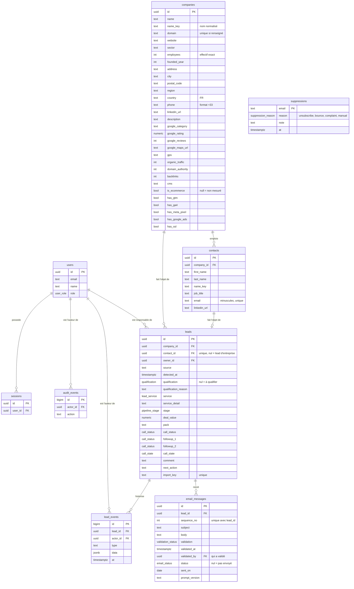

# 06 — Modèle de données PostgreSQL

| | |
|---|---|
| **Statut** | **Implémenté** : `users`, `sessions`, `audit_events` (phase 1) ; `companies`, `contacts`, `leads`, `email_messages`, `suppressions`, `lead_events` (phase 2). **Prévu** : `sourcing_runs`, `packs`, séquences d'e-mails (phases 4 et 5). Source de vérité du schéma : `apps/api/src/db/schema.ts`. |
| **Liens** | [Feuille de route](07-feuille-de-route.md) · [Analyse de l'export réel](11-analyse-export-airtable.md) · [Sortie d'Airtable](10-sortie-airtable-n8n.md) |

## 1. Principes

1. **PostgreSQL est la source de vérité.** Airtable n'est plus qu'une source d'import.
2. **Entreprise ≠ contact ≠ lead.** L'ancienne table à 57 colonnes mélangeait tout. Sur l'export réel : 6 sites web portent
   plusieurs contacts, et 783 prospects Google Maps n'ont **aucune personne** (seulement un standard). Une entreprise a 0 à n
   contacts ; un lead est le suivi commercial d'un contact **ou** de l'entreprise seule.
3. **Les listes de valeurs sont des types** (énumérations PostgreSQL) construits à partir du catalogue partagé
   `packages/shared/src/catalog.ts` : une définition pour la base, l'API et l'interface.
4. **Inconnu ≠ non.** Les indicateurs techniques d'un site (HTTPS, GA4…) valent `NULL` tant que le site n'a pas été mesuré.
5. **Tout changement laisse une trace** (`lead_events`), écrite dans la même transaction que la modification.
6. **L'anti-doublon est une contrainte de base de données**, pas une convention de code.
7. **Les données importées ne sont jamais écrasées** : après l'import, l'application fait foi.

## 2. Schéma

## 3. Choix qui découlent des données réelles

| Choix | Pourquoi (voir [11](11-analyse-export-airtable.md)) |
|---|---|
| `employees` est un **entier** | `Taille` contient des effectifs exacts (1 à 355 000), pas des tranches |
| Colonnes **typées** sur `companies` (pas de JSON « enrichissement ») | Elles sont filtrées et triées par l'interface ; un schéma explicite protège des données incohérentes |
| `call_status` **et** `call_state` | Deux usages distincts coexistaient : résultat d'appel (NRP, PI…) et file d'appel (« À appeler ») |
| `service` = 3 valeurs + `service_detail` | 25 formulations libres de 3 services ; la précision (Search, Shopping, suivi des conversions) est gardée à part |
| `qualification` **nul** = à qualifier | « À qualifier - Sans site web » (783) n'est pas une qualification |
| `email_messages.sent_on` est une **date** | L'ancienne base ne conserve pas l'heure d'envoi ; la phase 4 ajoutera l'horodatage |
| Pas de colonne « mots-clés organiques » | Toujours égale à 0 : source défaillante |
| `suppressions` alimentée dès l'import | 47 rebonds et 10 désinscrits ne doivent plus jamais recevoir d'e-mail |

## 4. Contraintes importantes

| Besoin | Mécanisme |
|---|---|
| Une entreprise n'existe qu'une fois | `UNIQUE (domain)` si renseigné ; sinon `UNIQUE (name_key, coalesce(phone, ''))`. **Le téléphone seul ne suffit pas** : 9 cas sur 17 numéros en double concernaient des entreprises différentes (standards, franchises) |
| Un contact n'existe qu'une fois | `UNIQUE (email)` si renseigné ; sinon `UNIQUE (company_id, name_key)` |
| Un seul lead par contact (ou par entreprise sans contact) | Index uniques partiels `leads_contact_uq` et `leads_company_only_uq` |
| Import rejouable | `UNIQUE (import_key)` ; l'import ne modifie jamais une ligne existante |
| **Jamais deux e-mails identiques à un lead** | `UNIQUE (lead_id, sequence_no)` ; en phase 4, l'envoi « réclame » le message par `UPDATE … WHERE status IS NULL AND validation = 'Validé' RETURNING …` (une seule ligne retournée = un seul envoi) |
| Pas d'envoi à une personne exclue | Contrôle de `suppressions` dans la transaction d'envoi (phase 4) |
| Valeur du deal cohérente | `CHECK (deal_value IS NULL OR deal_value >= 0)`, `numeric(12,2)` (jamais de flottant pour l'argent) |
| Étape et qualification valides | Énumérations PostgreSQL alimentées par le catalogue partagé |
| Historique fiable | `lead_events` écrit dans la même transaction que la modification |
| Recherche rapide | Index sur `detected_at`, `stage`, `qualification`, `service`, `owner_id`, `sector` ; mesuré : 4 à 12 ms sur 1 971 leads. Un index trigramme (`pg_trgm`) sera à envisager avec la montée en volume |

## 5. Règles de migration

- Une migration par changement, générée par `pnpm db:generate`, relue, commitée avec le code (la CI échoue sinon).
- **Expand / contract** : ajouter d'abord, supprimer dans un déploiement ultérieur. La version N-1 du code doit fonctionner
  avec le schéma N : c'est ce qui rend le retour arrière sûr.
- Jamais de modification d'une migration déjà fusionnée dans `dev` ou `main`.
- Les migrations tournent au démarrage de l'API, protégées par un verrou consultatif PostgreSQL.

## Relecture des e-mails (phase 4a)

- Un e-mail **envoyé** (`status` ou `sent_on` renseigné) n'est plus modifiable. Modifier l'objet ou le corps d'un e-mail
  validé le remet à « Pas Validé » (sauf validation explicite dans la même requête).
- **Validation interdite** sans adresse, avec une adresse présente dans `suppressions` (comparaison en minuscules), ou avec
  un objet ou un corps vide. Le rejet reste toujours possible.
- Modification concurrente : `expectedUpdatedAt` ; refus 409 si l'e-mail a changé depuis la lecture.
- Validation groupée : `POST /emails/bulk`, simulation (`dryRun`) puis application avec l'effectif simulé (`expectedCount`) ;
  ne touche que les e-mails « Pas Validé » non envoyés ; tracée dans `audit_events` (`emails.bulk_validation`).
- Historique `lead_events` : `email_edited` (noms des champs modifiés, jamais le texte) et `email_validation`
  (avant → après, `bulk` si groupée).
- Gabarit unique côté serveur (`apps/api/src/mail/template.ts`) : l'aperçu de l'interface et l'envoi futur l'utilisent tous
  deux. Expéditeur, agenda et signature : variables `MAIL_FROM_NAME`, `MAIL_FROM_ADDRESS`, `MAIL_AGENDA_TEXT`, `MAIL_SIGNATURE`.

## Fiabilité des adresses (phase 4b)

- `contacts.email_check` (`valid`, `invalid_syntax`, `no_mail_server`, `disposable`) et `email_checked_at` ; `null` = pas encore
  contrôlée. Un contrôle reste valable 30 jours.
- `POST /emails/address-check` (responsables, 10 appels/min, 300 adresses maximum par appel) contrôle les contacts dont l'e-mail
  n'est ni envoyé ni rejeté : syntaxe, liste courte de domaines jetables, puis DNS du domaine (MX, à défaut A/AAAA ; « MX nul » =
  aucun courrier). Un domaine n'est interrogé qu'une fois par appel. **Une panne DNS ne condamne jamais une adresse** : elle reste
  « à contrôler ».
- Une adresse `invalid_syntax`, `no_mail_server` ou `disposable` **ne peut pas être validée** (unitaire ni groupée) ; un e-mail déjà
  validé vers elle repasse « Pas Validé » (`lead_events` : `reason`). Le rejet reste possible.
- Limite assumée : on écarte les cas certains, on ne prouve pas qu'une boîte existe. Les rebonds réels (webhooks Brevo, lot 4c)
  alimentent `suppressions`. Un fournisseur de vérification de boîtes pourra s'ajouter derrière la même interface si le taux de
  rebond le justifie.
