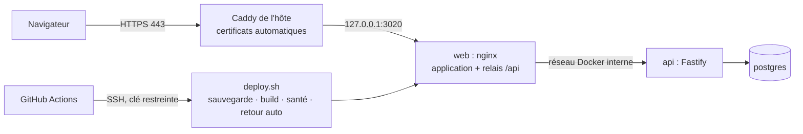

# 08 — Déploiement sur le VPS

Deux environnements sur le **même VPS dédié**, un par branche, chacun avec sa propre base :

| Environnement | Branche | Domaine (exemple) | Port local | Dossier | Projet Docker | Fichier d'env |
|---|---|---|---|---|---|---|
| Test | `dev` | `dev.crm.example.com` | 3120 | `~/growthlab-dev` | `growthlab-dev` | `.env.dev` |
| Production | `main` | `crm.example.com` | 3020 | `~/growthlab` | `growthlab` | `.env.prod` |

```
feature/xxx ──PR──► dev  ──CI verte──► déploiement auto sur dev.crm…        (test)
                     └──PR──► main ──CI verte──► (approbation) ──► crm…       (production)
```



Seul `127.0.0.1:WEB_PORT` est exposé par Docker ; l'API et la base ne sont jamais publiées sur le réseau de l'hôte.

## 1. Préparer le serveur (une fois)

Hypothèse : Debian/Ubuntu récent, accès `root` ou `sudo`. **Aucun nom de fournisseur n'est imposé.**

```bash
# utilisateur dédié, sans mot de passe, clés SSH uniquement
sudo adduser --disabled-password --gecos "" deploy
sudo usermod -aG docker deploy                      # après installation de Docker (docs.docker.com/engine/install)
# pare-feu : SSH, HTTP, HTTPS seulement
sudo ufw default deny incoming && sudo ufw allow 22/tcp && sudo ufw allow 80,443/tcp && sudo ufw enable
# mises à jour de sécurité automatiques
sudo apt install -y unattended-upgrades fail2ban curl git
# Caddy (HTTPS automatique) : https://caddyserver.com/docs/install#debian-ubuntu-raspbian
```

Dans `/etc/ssh/sshd_config` : `PasswordAuthentication no`, `PermitRootLogin no`. Sur un serveur de 4 Go de RAM ou moins,
ajoutez du **swap** (la construction des images consomme de la mémoire).

## 2. DNS

Deux enregistrements **A** vers l'IP du VPS : `crm` et `dev.crm` (remplacez par vos vrais domaines partout, y compris
dans `deploy/Caddyfile`).

## 3. Récupérer le code (une fois, en tant que `deploy`)

```bash
git clone https://github.com/kateguttillastone-cmyk/growthlab-agency-crm.git ~/growthlab
git clone -b dev https://github.com/kateguttillastone-cmyk/growthlab-agency-crm.git ~/growthlab-dev
```

Dépôt privé : créez une **clé de déploiement en lecture seule** (Settings → Deploy keys) et utilisez-la pour le clonage.

## 4. Fichiers de configuration (un par environnement)

```bash
cd ~/growthlab     && cp deploy/env.prod.example .env.prod && chmod 600 .env.prod && nano .env.prod
cd ~/growthlab-dev && cp deploy/env.prod.example .env.dev  && chmod 600 .env.dev  && nano .env.dev
```

Générez chaque secret avec `openssl rand -hex 32`. Pour **dev** : `DOMAIN=dev.crm…`, `WEB_PORT=3120`. Ces fichiers ne sont
**jamais** commités. Gardez une copie de `.env.prod` dans votre gestionnaire de mots de passe : elle est nécessaire pour
reconstruire le serveur.

## 5. Caddy

```bash
sudo cp /etc/caddy/Caddyfile /etc/caddy/Caddyfile.bak
cat ~/growthlab/deploy/Caddyfile | sudo tee -a /etc/caddy/Caddyfile > /dev/null    # adaptez d'abord les domaines
sudo caddy validate --config /etc/caddy/Caddyfile && sudo systemctl reload caddy
```

## 6. Premier lancement

```bash
cd ~/growthlab-dev && docker compose -p growthlab-dev -f docker-compose.prod.yml --env-file .env.dev  up -d --build
cd ~/growthlab     && docker compose -p growthlab     -f docker-compose.prod.yml --env-file .env.prod up -d --build
```

L'API applique les migrations et crée l'administrateur de `SEED_ADMIN_EMAIL` au démarrage. Connectez-vous, **changez le
mot de passe** (« Mon profil »), puis retirez `SEED_ADMIN_PASSWORD` du fichier d'environnement si vous le souhaitez
(il n'est utilisé qu'à la création).

## 7. Déploiement automatique (une fois)

Le workflow **CI** tourne à chaque PR et push sur `dev`/`main`. S'il est vert, **Déploiement** se connecte au VPS et lance
`deploy/deploy.sh <branche>` qui : sauvegarde la base, récupère le code, reconstruit, vérifie que la chaîne
web → API → base répond, et **revient à la version précédente** sinon.

**Sur le VPS — clé dédiée, limitée au script de déploiement :**

```bash
ssh-keygen -t ed25519 -N "" -C "github-actions-growthlab" -f ~/.ssh/gh_deploy_growthlab
echo "command=\"$HOME/growthlab/deploy/deploy.sh\",no-port-forwarding,no-X11-forwarding,no-agent-forwarding,no-pty $(cat ~/.ssh/gh_deploy_growthlab.pub)" >> ~/.ssh/authorized_keys
cat ~/.ssh/gh_deploy_growthlab                       # clé privée à copier en entier dans le secret GitHub
echo "IP_DU_VPS $(cut -d' ' -f1,2 /etc/ssh/ssh_host_ed25519_key.pub)"      # empreinte du serveur
shred -u ~/.ssh/gh_deploy_growthlab                  # après copie
```

La clé ne peut rien faire d'autre que lancer `deploy.sh` avec `main`, `dev` ou `rollback <main|dev> [sha]`.

**GitHub → Settings → Environments** : créez `test` et `production`. Sur `production`, activez **Required reviewers**
(le déploiement attend votre approbation). Dans chaque environnement, ou au niveau du dépôt :

| Secret | Valeur |
|---|---|
| `DEPLOY_HOST` | IP du VPS |
| `DEPLOY_USER` | `deploy` |
| `DEPLOY_SSH_KEY` | la clé privée ci-dessus |
| `DEPLOY_KNOWN_HOSTS` | la ligne d'empreinte |

**Settings → Branches** : protégez `main` et `dev` (PR obligatoire, CI « Lint, types, tests, build » et « Images Docker… »
requises, historique linéaire). **Settings → Code security** : activez *secret scanning* et *push protection*.

## 8. Au quotidien

1. Travail sur `feature/...`, PR vers **`dev`** : la CI la teste ; à la fusion, l'environnement de test se met à jour.
2. Une fois validé, PR **`dev` → `main`** : à la fusion et après approbation, la production se met à jour.
3. Suivi : onglet **Actions**. Redéployer à la main : `~/growthlab/deploy/deploy.sh main`.
4. La version déployée est visible dans `GET /api/health` (`version` = SHA court du commit).

## 9. Retour arrière

| Situation | Action |
|---|---|
| Le nouveau code ne démarre pas | **Automatique** : `deploy.sh` rétablit le commit précédent et le dit dans le journal |
| Le code démarre mais se comporte mal | Actions → **Retour arrière** → environnement (`main`), SHA vide = dernière version saine, ou `deploy/deploy.sh rollback main` |
| Retour à un commit précis | `deploy/deploy.sh rollback main <sha>` |
| La migration a abîmé des données | `deploy/restore.sh main <sauvegarde>` — voir [09](09-exploitation.md). Une sauvegarde est prise **avant chaque déploiement** |

Le retour arrière **ne défait pas les migrations** : elles sont écrites pour rester compatibles avec la version précédente
(ajout d'abord, suppression plus tard — [06 §4](06-modele-donnees.md)).

## 10. Dépannage

| Symptôme | Cause probable | Solution |
|---|---|---|
| `Permission denied (publickey)` au déploiement | clé mal copiée, ligne absente de `authorized_keys` | refaire l'étape 7 |
| `Host key verification failed` | VPS réinstallé | mettre à jour `DEPLOY_KNOWN_HOSTS` |
| `required variable … is missing` | ligne vide dans `.env.prod` / `.env.dev` | compléter le fichier |
| `port is already allocated` | port pris par un autre service | `ss -ltnp`, changer `WEB_PORT` |
| Erreur de certificat | DNS pas encore propagé | `nslookup crm.example.com`, puis `sudo systemctl reload caddy` |
| Le workflow Déploiement ne démarre pas | la CI est rouge | corriger la CI (onglet Actions) |
| Construction `Killed` / code 137 | mémoire insuffisante | ajouter du swap |
| Connexion impossible, 403 « Origine non autorisée » | `DOMAIN` ne correspond pas à l'adresse utilisée | corriger `DOMAIN` puis redéployer |
| Trop de requêtes (429) pour tout le monde | l'adresse IP vue par l'API est celle du proxy | vérifier que Caddy transmet bien `X-Forwarded-For` (l'API fait confiance au proxy en production) |
