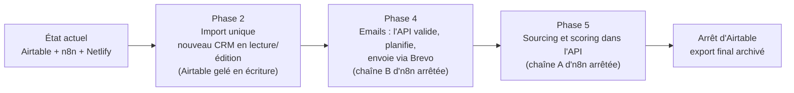

# 10 — Sortie d'Airtable et d'n8n

L'ancien système (Airtable + n8n « Lead Pilot » + Netlify, dossier [`legacy/`](../legacy/)) continue de tourner pendant
la construction du nouveau. Ce document couvre (1) la **correspondance des champs**, (2) les **correctifs urgents** à
appliquer au workflow actuel sans attendre, (3) le **plan de bascule** et son retour arrière.

> **Mise à jour : l'import est réalisé et validé** sur l'export réel (1 976 lignes ; analyse chiffrée dans
> [11](11-analyse-export-airtable.md)). La correspondance ci-dessous décrit ce que fait réellement l'importeur
> (`apps/api/src/import/`). Les données montrent aussi que **665 e-mails sont réellement partis** : le point 2 du §2 n'est plus
> une question mais un fait.

Sources : analyse du dépôt et du workflow n8n ([01](01_conception_produit.md) §2.3, [03](03_cahier_des_charges.md) §9,
[04](04_architecture_technique_et_systeme.md) §5bis). Les webhooks `crm-bridge-*`, le sourcing Google Maps et le retour des
statuts email de Brevo **ne figurent pas** dans le workflow analysé : à retrouver avant la bascule (§4).

## 1. Correspondance des champs Airtable → PostgreSQL (implémentée)

| Airtable (table `BDD`) | Cible | Traitement |
|---|---|---|
| Prénom, Nom, Poste, Email, Linkedin | `contacts` | E-mail en minuscules, format vérifié (sinon ignoré avec avertissement). Pas de contact si ni nom ni e-mail |
| Entreprise, Site web, Secteur, Taille, Année de création, Adresse complète, Ville, Etat, Pays, Linkedin Entreprise, Description | `companies` | `domain` = site sans protocole, `www.`, chemin ni port ; `Taille` = **effectif entier** ; ville et code postal **déduits de l'adresse** si absents ; `Pays` → `FR` |
| Téléphone | `companies.phone` | Format `+33…` ; c'est le téléphone de l'**entreprise** (standard) |
| Qualification | `leads.qualification` | Chaud / Tiède / Froid ; « À qualifier… » → **vide** (non qualifié) |
| Raison, Service recommandé | `leads.qualification_reason`, `service`, `service_detail` | 25 formulations → 3 services ; formulation d'origine gardée |
| STATUT, RELANCE 1, RELANCE 2 | `leads.call_status`, `followup_1`, `followup_2` | Valeur inconnue → vide + avertissement |
| Statut appel | `leads.call_state` | « À appeler », « Pas intéressé »… |
| COMMENTAIRE, Prochaine action Kate / Ifaliana | `leads.comment`, `next_action` | La note « Email vide suite à une panne… » est **ignorée** quand l'e-mail existe |
| Étape pipeline, Valeur deal, Pack, Responsable | `leads.stage`, `deal_value`, `pack`, `owner_id` | `Responsable` rapproché d'un compte par nom ou e-mail, sinon avertissement |
| Date détection | `leads.detected_at` | ISO avec fuseau |
| Source | `leads.source` | Texte libre conservé |
| Trafic organique, Autorité domaine, Backlinks, CMS | `companies.*` | `Mots-clés organiques` **ignoré** (toujours 0) |
| E-commerce, GTM, GA4, Pixel Meta, Signal Google Ads, SSL | `companies.is_ecommerce`, `has_*` | « checked » → oui ; vide → non **si le site a été mesuré**, inconnu sinon |
| Categorie Google Maps, Note Google, Nombre avis, Fiche Google My Business, Coordonnees GPS | `companies.google_*`, `gps` | |
| Email objet, Email corps, Validation mail, Derniere validation, Email envoyé le, Statut email, Version_prompt_email | `email_messages` | Validation par défaut « Pas Validé » ; `Email envoyé le` = **date** (pas d'heure) ; `Derniere validation` lue dans le fuseau `--tz` (défaut -04:00) |
| Statut email = Bounce / Désinscrit | `suppressions` | Rebond → `bounce`, désinscription → `unsubscribe` : ces adresses ne seront plus jamais contactées |
| Persona | — | Ignoré (requête de sourcing, pas une donnée du prospect) |

**Garanties** : simulation (`--dry-run`) ; rapport **sans donnée personnelle** ; rejouable (clés naturelles, aucun écrasement) ;
lignes vides et doublons signalés ; une seule transaction (tout ou rien). Mode d'emploi : [11 §5](11-analyse-export-airtable.md).

## 2. Correctifs urgents sur le workflow n8n actuel (avant tout code)

À faire dans l'instance n8n de production. Ils ne dépendent pas du nouveau système et réduisent des risques actuels.

| # | Action | Pourquoi (constat) | Comment |
|---|---|---|---|
| 1 | **Révoquer puis renouveler** le jeton Apify et la clé API Anthropic | stockés en clair dans les paramètres de 7 nœuds (jeton Apify dans 6 nœuds, clé Anthropic dans `Claude Scoring`) | Chez chaque fournisseur : créer la nouvelle clé, **révoquer l'ancienne**. Dans n8n : créer des *Credentials* (Header Auth) et les référencer depuis les nœuds ; vérifier qu'aucun export JSON du workflow n'a été partagé ou commité |
| 2 | Lever l'ambiguïté « mode test » du nœud d'envoi | **Confirmé par les données : 665 e-mails sont réellement partis à de vrais prospects.** Le nœud « TEST MODE » envoie à l'e-mail du lead alors que sa note dit l'inverse | Décider : test ou production. Si test : destinataire fixe et préfixe `[TEST]`. Si production : renommer le nœud, supprimer la note, supprimer ou réactiver le nœud Gmail de test |
| 3 | Authentifier le webhook `search-leads` | aucun contrôle ; n'importe qui connaissant l'URL peut lancer des exécutions Apify payantes | *Webhook → Authentication → Header Auth* avec un secret ; le même secret dans l'appel de `bridge.js` (`x-bridge-secret`) |
| 4 | Garde anti double envoi | le déclencheur Airtable peut se rejouer ; l'envoi est différé de plusieurs jours | Avant l'envoi : relire le lead et s'arrêter si `Email envoyé le` est renseigné ; poser `Statut email = En file` dès la réception |
| 5 | Limiter la synchronisation Brevo | renvoie **tous** les leads validés toutes les 10 min | Ajouter une case « Synchro Brevo » dans Airtable, filtrer dessus, la cocher après l'upsert |
| 6 | Alerte d'échec | des erreurs sont absorbées sur 11 nœuds | Créer un workflow *Error Trigger* qui notifie par e-mail |
| 7 | Contrôle des secrets avant tout partage | l'export contient des clés | Ne jamais exporter « avec identifiants » ; passer l'export par `scripts/check-no-secrets.sh` |

## 3. Plan de bascule

La bascule se fait **chaîne par chaîne**, pas d'un bloc, et chaque étape est réversible.

| Étape | Condition d'entrée | Gel et retour arrière |
|---|---|---|
| **Import** (phase 2) | Rapport d'écarts relu et accepté | On **gèle** les écritures dans Airtable (consigne à l'équipe, vue en lecture seule). Retour arrière : réactiver Airtable ; les modifications faites dans le nouveau CRM entre-temps sont à reporter à la main (d'où une courte période, avec test préalable sur l'environnement de test) |
| **Emails** (phase 4) | `SEND_MODE=test` validé de bout en bout ; contrainte anti-doublon testée sous concurrence ; table `suppressions` alimentée depuis Brevo | Désactiver la chaîne B d'n8n **avant** d'activer l'envoi par l'API (jamais les deux en même temps : risque de double envoi). Retour arrière : réactiver n8n, `SEND_MODE=test` côté API |
| **Sourcing** (phase 5) | 3 sourcings comparés (ancienne et nouvelle chaîne) avec écarts expliqués | Désactiver la chaîne A d'n8n. Retour arrière : réactiver |
| **Arrêt d'Airtable** | 30 jours sans lecture d'Airtable | Export CSV complet archivé (chiffré), accès supprimé, clés révoquées |

## 4. À retrouver avant la bascule

- Les workflows qui exposent `crm-bridge-list`, `crm-bridge-schema`, `crm-bridge-update`, `crm-bridge-brevo` (lecture,
  écriture et statistiques du CRM actuel) : ils disparaissent avec l'ancien CRM, mais leurs règles cachées (filtres,
  calculs de statistiques) sont à relire.
- Le workflow qui renseigne les champs Google Maps et celui qui écrit en retour les statuts d'email (`Délivré`, `Ouvert`,
  `Bounce`, `Désinscrit`) : à remplacer par les webhooks Brevo de la phase 4.
- Le schéma réel d'Airtable (types, valeurs de listes) pour finaliser l'import.
- Le nombre réel de leads et d'utilisateurs, pour valider le dimensionnement ([05 §3.1](05_strategie_amelioration_et_deploiement.md)).

## 5. Ce que devient chaque morceau de l'ancien système

| Ancien | Devient |
|---|---|
| Fonction Netlify `bridge.js` (mot de passe partagé) | API Fastify avec comptes nominatifs (phase 1 ✅) |
| `source-artifact.html` + `build_site.py` | Application React (phases 2 à 6) ; `legacy/` conservé comme référence |
| Chaîne A d'n8n (sourcing, enrichissement, scoring) | Module sourcing de l'API (phase 5) |
| Chaîne B d'n8n (créneau, mise en forme, envoi, « Contacté ») | File d'envoi pg-boss + Brevo (phase 4) |
| Chaîne C d'n8n (synchro liste Brevo) | Inutile : l'API envoie directement et tient la liste de désinscription |
| Airtable | PostgreSQL |
